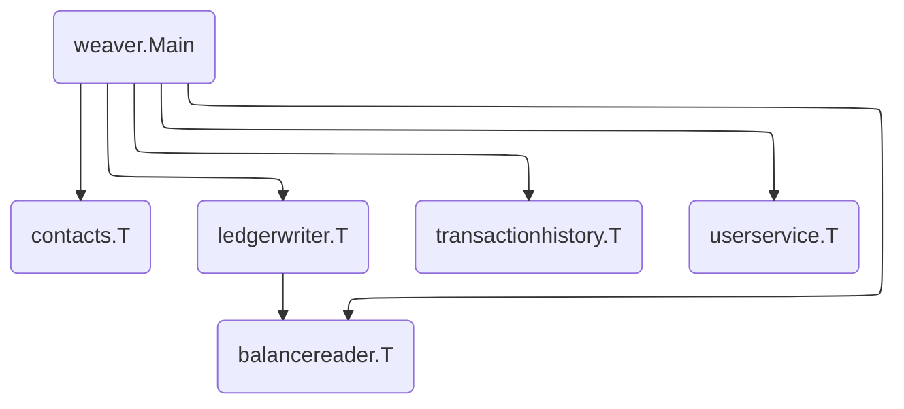

# Bank of Anthos

This directory contains a port of Google Cloud's [Bank of Anthos][boa] demo
application.



## Getting Started

- TODO(mwhittaker): Re-write the app to use sqlite locally. Setting up postgres
  is tedious.
- TODO(mwhittaker): Re-write the app to use the JWT credentials shipped with the
  original bank of anthos app.

First, install [postgres][postgres]. Create an `admin` user with password
`admin`. Then, create two databases, `postgresdb` and `accountsdb`, both owned
by `admin`. Use `postgresdb.sql` and `accountsdb.sql` to initialize the
`postgresdb` and `accountsdb` databases respectively. Then, run
[`1_create_transactions.sh`][1_create_transactions.sh] to populate `postgresdb`.
These scripts were taken from [`ledger-db/initdb/`][ledger-db] and
[`accounts-db/initdb/`][accounts-db].

Next, create a private key and public key for JWT called `jwtRS256.key` and
`jwtRS256.key.pub` inside `/tmp/.ssh`.

```
openssl genrsa -out jwtRS256.key 4096
openssl rsa -in jwtRS256.key -outform PEM -pubout -out jwtRS256.key.pub
mkdir -p /tmp/.ssh
mv jwtRS256.key jwtRS256.key.pub /tmp/.ssh
```

Finally, run the application with one of the following commands.

```
$ SERVICEWEAVER_CONFIG=weaver.toml go run .
$ weaver single deploy weaver.toml
$ weaver multi deploy weaver.toml
```

[1_create_transactions.sh]: https://github.com/GoogleCloudPlatform/bank-of-anthos/blob/main/src/ledger/ledger-db/initdb/1_create_transactions.sh
[accounts-db]: https://github.com/GoogleCloudPlatform/bank-of-anthos/tree/main/src/accounts/accounts-db/initdb
[boa]: https://github.com/GoogleCloudPlatform/bank-of-anthos
[ledger-db]: https://github.com/GoogleCloudPlatform/bank-of-anthos/tree/main/src/ledger/ledger-db/initdb
[postgres]: https://www.postgresql.org/
