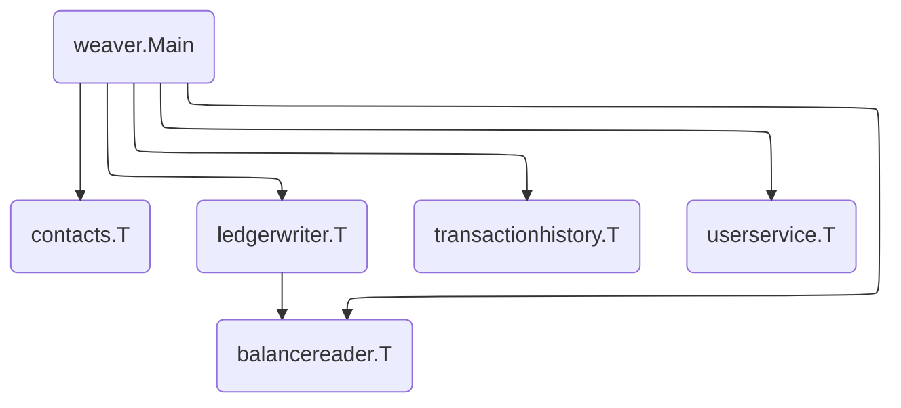

# Bank of Anthos

This directory contains a port of Google Cloud's [Bank of Anthos][boa] demo
application.



## Running Locally

- TODO(mwhittaker): Re-write the app to use the JWT credentials shipped with the
  original bank of anthos app.

First, run and initialize a local [Postgres][postgres] instance.

1. Create an `admin` user with password `admin`.
2. Create two databases, `postgresdb` and `accountsdb`, both owned by `admin`.
3. Use `postgresdb.sql` and `accountsdb.sql` to initialize the `postgresdb` and
   `accountsdb` databases respectively.
4. Run `1_create_transactions.sh` to populate `postgresdb`.

Note that these scripts were taken from [`ledger-db/initdb/`][ledger-db] and
[`accounts-db/initdb/`][accounts-db].

We recommend using Docker to perform these steps:

```shell
# Run the Postgres instance.
$ docker run \
    --rm \
    --detach \
    --name postgres \
    --env POSTGRES_PASSWORD=password \
    --volume="$(realpath postgres.sh):/app/postgres.sh" \
    --volume="$(realpath postgresdb.sql):/app/postgresdb.sql" \
    --volume="$(realpath accountsdb.sql):/app/accountsdb.sql" \
    --volume="$(realpath 1_create_transactions.sh):/app/1_create_transactions.sh" \
    --publish 127.0.0.1:5432:5432 \
    postgres

# Wait about 10 seconds for the Postgres instance to start. Then, run the
# postgres.sh script in the container.
docker exec -it postgres /app/postgres.sh
```

Next, create a private key and public key for JWT called `jwtRS256.key` and
`jwtRS256.key.pub` inside `/tmp/.ssh`.

```shell
$ openssl genrsa -out jwtRS256.key 4096
$ openssl rsa -in jwtRS256.key -outform PEM -pubout -out jwtRS256.key.pub
$ mkdir -p /tmp/.ssh
$ mv jwtRS256.key jwtRS256.key.pub /tmp/.ssh
```

Finally, run the application.

```shell
$ go build .

# Run the application in a single process.
$ weaver single deploy weaver.toml

# Run the application in multiple processes.
$ weaver multi deploy weaver.toml
```

[accounts-db]: https://github.com/GoogleCloudPlatform/bank-of-anthos/tree/main/src/accounts/accounts-db/initdb
[boa]: https://github.com/GoogleCloudPlatform/bank-of-anthos
[ledger-db]: https://github.com/GoogleCloudPlatform/bank-of-anthos/tree/main/src/ledger/ledger-db/initdb
[postgres]: https://www.postgresql.org/
