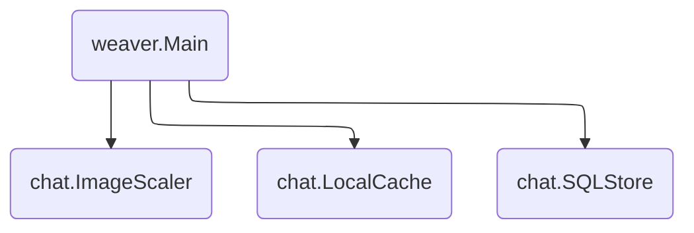

# Chat

An example chat application.



## How to Run Locally

First, run a local MySQL instance and initialize it with [`chat.sql`](chat.sql).
We recommend using Docker for this:

```shell
# Run the MySQL instance.
$ docker run \
      --rm \
      --detach \
      --name mysql \
      --env MYSQL_ROOT_PASSWORD="password" \
      --env MYSQL_DATABASE="serviceweaver_chat_example" \
      --volume="$(realpath chat.sql):/app/chat.sql" \
      --publish 127.0.0.1:3306:3306 \
      mysql

# Initialize the MySQL database.
$ docker exec mysql sh -c "mysql --password=password < /app/chat.sql"
```

Then, update the `db_uri` field in `weaver.toml` to point to your MySQL
instance. If you used the Docker commands above, the default value of `db_uri`
should already point to your database. You don't have to change anything.

Finally, run the application.

```shell
$ go build .

# Run the application in a single process.
$ weaver single deploy weaver.toml

# Run the application in multiple processes.
$ weaver multi deploy weaver.toml
```

## How to run on GKE

Create a new MySQL instance on [Cloud SQL][cloud_sql]. During creation, ensure
the `"No password"` and `"Private IP"` options are checked and the latter is
configured to use the `"default"` network.

Once the instance is created, copy the IP address from the instance dashboard
and substitute it for `localhost` in the `weaver.toml` file.

Deploy the app:

```sh
$ weaver-gke deploy ./weaver.toml
```

[cloud_sql]: https://cloud.google.com/sql
