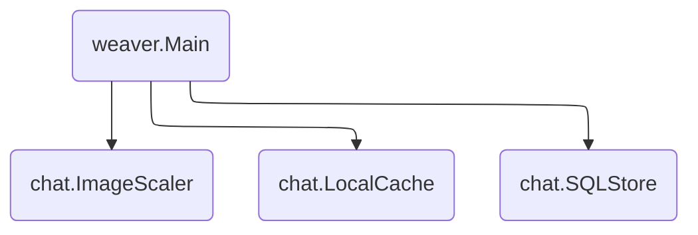

# Chat

An example chat application.



## How to Run Locally

```sh
$ go run .
```

## How to run on GKE

Create a new MySQL instance on [Cloud SQL][cloud_sql]. During creation, ensure
the `"No password"` and `"Private IP"` options are checked and the latter is
configured to use the `"default"` network.

Once the instance is created, copy the IP address from the instance dashboard
and substitute it for `localhost` in the `weaver.toml` file.

Deploy the app:

```sh
$ weaver-gke deploy ./weaver.toml
```

[cloud_sql]: https://cloud.google.com/sql
