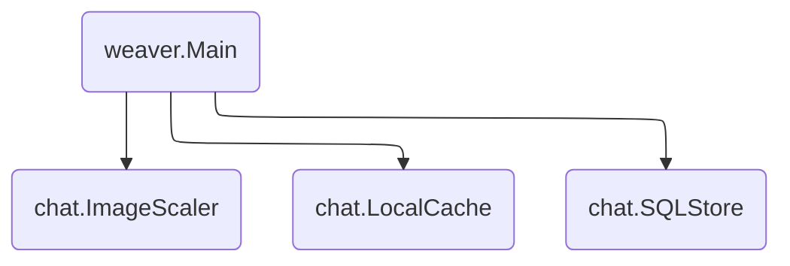

# Chat

An example chat application.



## How to Run Locally

First, run a local MySQL instance and initialize it with [`chat.sql`](chat.sql).
We recommend using Docker for this:

```shell
# Run the MySQL instance.
$ docker run \
      --rm \
      --detach \
      --name mysql \
      --env MYSQL_ROOT_PASSWORD="password" \
      --env MYSQL_DATABASE="chat" \
      --volume="$(realpath chat.sql):/app/chat.sql" \
      --publish 127.0.0.1:3306:3306 \
      mysql

# Wait about ten seconds for the MySQL instance to start. Then, initialize the
# chat database with chat.sql.
$ docker exec mysql sh -c "mysql --password=password < /app/chat.sql"
```

Next, update the `db_uri` field in `weaver.toml` to point to your MySQL
instance. If you used the Docker commands above, the default value of `db_uri`
should already point to your database. You don't have to change anything.

Finally, run the application.

```shell
$ go build .

# Run the application in a single process.
$ weaver single deploy weaver.toml

# Run the application in multiple processes.
$ weaver multi deploy weaver.toml
```

## How to Run on Kubernetes

First, run a MySQL instance in your Kubernetes cluster and initialize it with
[`chat.sql`](chat.sql). We recommend using [`mysql.yaml`](mysql.yaml) for this:

```shell
$ kubectl apply -f mysql.yaml
```

Next, update the `db_uri` field in `weaver.toml` to point to your MySQL
instance. If you're using `mysql.yaml`, then you should update the `SQLStore`
section of `weaver.toml` to have the following contents:

```toml
["github.com/ServiceWeaver/weaver/examples/chat/SQLStore"]
db_driver = "mysql"
db_uri = "root:password@tcp(mysql:3306)/chat"
```

Then, update the `repo` field in `weaver.toml` with the Docker repository where
the chat application will be uploaded. For example, if your Docker Hub username
is `myusername`, you can update the `[kube]` section of `weaver.toml` to the
following:

```toml
[kube]
listeners.chat = {public = true}
repo = "docker.io/myusername/"
```

See `weaver kube deploy --help` for more information on the `repo` field.

Finally, deploy the application using `weaver kube`.

```shell
$ go build .
$ kubectl apply -f $(weaver kube deploy weaver.toml)
```

## How to Run on GKE

Create a new MySQL instance on [Cloud SQL][cloud_sql]. During creation, ensure
the `"No password"` and `"Private IP"` options are checked and the latter is
configured to use the `"default"` network.

Once the instance is created, copy the IP address from the instance dashboard
and substitute it for `localhost` in the `weaver.toml` file.

Deploy the app:

```sh
$ weaver-gke deploy ./weaver.toml
```

[cloud_sql]: https://cloud.google.com/sql
