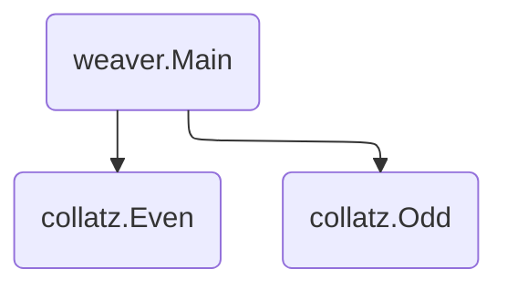

# Collatz

This directory contains a Service Weaver application that explores the
[Collatz conjecture][collatz]. Given a positive integer `x`, the Collatz process
is the process of repeatedly executing the following operation:

-   If `x` is even, set `x` to `x/2`.
-   If `x` is odd, set `x` to `3x+1`.

For example, if we execute the Collatz process on `x = 10`, then we get the
sequence of numbers `10, 5, 16, 8, 4, 2, 1`. This sequence of numbers is called
the hailstone sequence of 10. The Collatz conjecture states that the hailstone
sequence of every positive number reaches 1. Nobody knows if the Collatz
conjecture is true; it is one of the most famous unsolved problems in
mathematics.

This Service Weaver application implements a service that executes the Collatz process.
You can send the service a positive number, and the server replies with that
number's hailstone sequence.

## Components

This Service Weaver application has three components: `main`, `Odd` and `Even`. Given a
positive number `x`, main repeatedly calls `Odd` (if `x` is odd) or `Even` (if
`x` is even) to receive the next number in the hailstone sequence.



This application highlights the benefits of colocation. The performance of the
application improves significantly when `main`, `Odd`, and `Even` are colocated
in the same OS process.

## Running Locally

To run this app locally, run `go run .`. In a separate terminal, curl the
service (which defaults to `localhost:9000`):

```console
$ go run .                  # In one terminal.
$ curl localhost:9000?x=27  # In a different terminal.
```

To run the app across multiple processes, use `weaver multi deploy`. The
`weaver.toml` config file runs every component in a separate process, and the
`colocated.toml` config file colocates all three components.

```console
$ weaver multi deploy weaver.toml     # not colocated
$ weaver multi deploy colocated.toml # colocated
```

## Running on GKE

To run the app on GKE, use `weaver gke deploy`:

```console
$ weaver gke deploy weaver.toml
```

[collatz]: https://en.wikipedia.org/wiki/Collatz_conjecture
