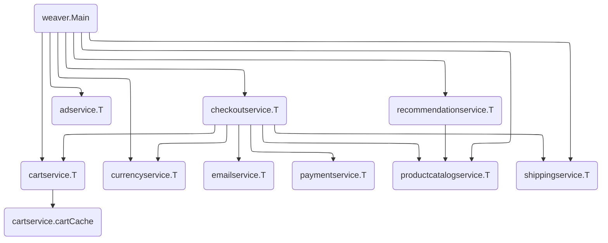

# Online Boutique

This directory contains the port of the Google Cloud's [`Online
Boutique`][boutique] demo application.

Here are the changes made to the original application:

* All of the services that weren't written in `Go` have been ported to `Go`.
* All of the networking calls have been replaced with the corresponding
  Service Weaver calls.
* All of the logging/tracing/monitoring calls have been replaced with the
  corresponding Service Weaver calls.
* The code is organized as a single Go module.

[boutique]: https://github.com/GoogleCloudPlatform/microservices-demo
