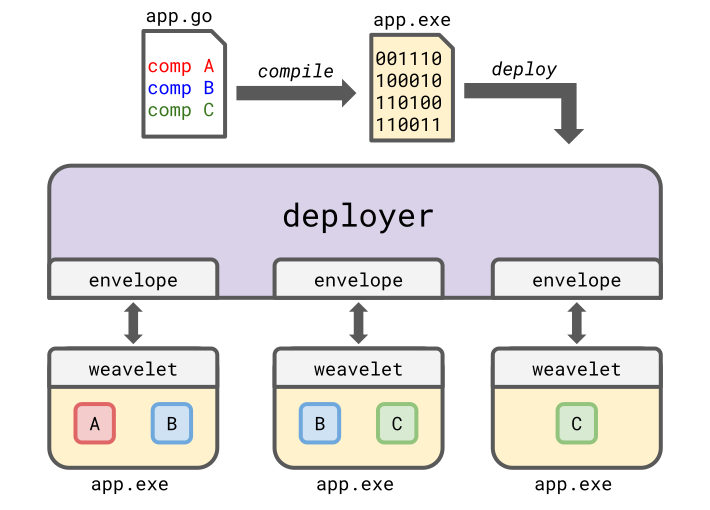
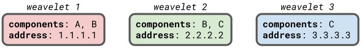

# How to Implement a Service Weaver Deployer

<div class="blog-author">Michael Whittaker</div>
<div class="blog-date">April 5, 2023 (Updated August 14, 2023)</div>

Service Weaver allows you to deploy an application in many different ways. For
example, you can deploy an application in a [single process][singleprocess],
across [multiple processes][multiprocess], or in [the cloud][gke]. The code that
deploys a Service Weaver application is called, unsurprisingly, a **deployer**.
This blog post explains what deployers are and how to implement one. We'll
assume you're familiar with how to write Service Weaver applications. If you're
not, we recommend you read the [step-by-step tutorial][tutorial].

## Overview

A Service Weaver application consists of a number of [components][]. The
application is compiled into a single application binary. A deployer deploys an
application by running the binary multiple times, often across multiple
machines. Every instance of the binary runs a subset of the components. To learn
which components to run, the binary links in a small background agent called a
weavelet, which a deployer communicates with using an envelope. This is
illustrated below.

<figure>
  
</figure>

In this blog post, we provide a high-level overview of weavelets, deployers, and
envelopes. Then, we get down to the nitty-gritty of exactly how they work by
implementing a multiprocess deployer completely from scratch.

## Weavelets

To understand deployers, we must first understand weavelets. A Service Weaver
application is compiled into a single executable binary. The Service Weaver
libraries linked into the binary include a small agent called a **weavelet**,
which is created when you call [`weaver.Run`][Run]. A weavelet's main
responsibility is to start and manage a set of components.

When a Service Weaver application is deployed, there isn't just one weavelet. If
there were, Service Weaver applications wouldn't be very distributed. Rather,
deployers run your binary multiple times&mdash;in different processes across
different machines&mdash;to launch multiple weavelets which work together to
execute your distributed application.

Every weavelet hosts a potentially different set of components. Because
components are replicated, a component may be hosted by multiple weavelets. For
example, consider an application with components `A`, `B`, and `C`. An
example deployment consisting of three weavelets is shown in the figure below.
Weavelet 1 hosts components `A` and `B`; weavelet 2 hosts components `B` and
`C`, and weavelet 3 hosts component `C`.

<figure>
  
</figure>

You'll also notice that every weavelet has a unique network address. Weavelets
use these addresses to execute remote methods calls. For example, imagine
component `A` on weavelet 1 in the figure above wants to call a method on
component `C`. Weavelet 1 will contact either weavelet 2 on address 2.2.2.2 or
weavelet 3 on address 3.3.3.3 to execute the method.

## Deployers

A deployer distributes a Service Weaver application by launching and managing a
set of weavelets. Managing weavelets involves four main responsibilities
related to (1) components, (2) listeners, (3) telemetry, and (4) security.

1. **Components**. A deployer starts weavelets and tells them which components
   to host. A deployer also ensures that weavelets know the addresses of other
   weavelets. If a deployer starts a new weavelet, for example, the deployer
   notifies all other weavelets of the existence of the new weavelet, including
   its address and the components it's hosting. Conversely, if a deployer
   detects that a weavelet has failed, the deployer notifies all other weavelets
   of its failure.

2. **Listeners**. When a component wants to serve external traffic, it requests
   a network listener. The deployer picks an address for the listener and
   ensures that the listener is publicly accessible. Multiple weavelets may
   share the same listener, and a deployer must ensure that traffic is balanced
   across them. This often involves running or configuring a proxy.

3. **Telemetry**. A deployer collects, aggregates, and exports all telemetry
   produced by weavelets. This includes logs, metrics, traces, and profiles.

4. **Security**. A deployer can optionally enable [mTLS][mtls] between
   components. When mTLS is enabled, a deployer is responsible for distributing
   and validating certificates. To keeps things as simple as possible, we'll
   leave mTLS disabled for the remainder of this article.

A deployer and a weavelet communicate by making remote procedure calls over Unix
domain sockets to each other. We call the part of a deployer that communicates
with a weavelet an **envelope**. New deployers can be built by using
ServiceWeaver's [`Envelope`][Envelope] API.

Communication between an envelope and a weavelet is either weavelet initiated or
envelope initiated. Weavelet initiated communication shows up as a method call
to an [`EnvelopeHandler`][EnvelopeHandler] interface supplied by the deployer
implementation.

Envelope initiated communication is performed by invoking a method on
[`Envelope`][Envelope].

## A Simple Multiprocess Deployer

In this section, we implement [a fully working multiprocess
deployer][multi_deployer]. We'll compile our deployer into an executable called
`deploy`. We'll then be able to deploy Service Weaver binaries by running
`./deploy <Service Weaver binary>`. To make things simple, our deployer won't
co-locate or replicate any components. Every component will run by itself in a
separate process. We begin by declaring types for the deployer and for weavelets.

```go
package main

import ...

// deployer is a simple multiprocess deployer that doesn't implement
// co-location or replication. That is, every component is run in its own OS
// process, and there is only one replica of every component.
type deployer struct {
    mu       sync.Mutex          // guards handlers
    handlers map[string]*handler // handlers, by component
}

// A handler handles messages from a weavelet. It implements the
// EnvelopeHandler interface.
type handler struct {
    deployer *deployer          // underlying deployer
    envelope *envelope.Envelope // envelope to the weavelet
    address  string             // weavelet's address
}

// Check that handler implements the envelope.EnvelopeHandler interface.
var _ envelope.EnvelopeHandler = &handler{}
```

Next, we implement a `spawn` method that spawns a weavelet to host a component.

1. To spawn the weavelet and get an `Envelope` to communicate with it, we call
   the [`envelope.NewEnvelope`][NewEnvelope] function. This function takes in a
   [`WeaveletArgs`][WeaveletArgs] that's passed to the weavelet and an
   [`AppConfig`][AppConfig] that describes the application. `NewEnvelope` runs
   the provided Service Weaver binary&mdash;`flag.Arg(0)` in this case&mdash;in
   a subprocess. It then returns an `Envelope` which communicates with the
   weavelet via remote procedure calls.
2. We call the `UpdateComponents` method to tell the weavelet which component to
   run. A deployer should call `UpdateComponents` whenever there is a change to
   the set of components a weavelet should be running.
3. We call `envelope.Serve` to handle requests from the weavelet.

```go
// The unique id of the application deployment.
var deploymentId = uuid.New().String()

// spawn spawns a weavelet to host the provided component (if one hasn't
// already spawned) and returns a handler to the weavelet.
func (d *deployer) spawn(component string) (*handler, error) {
    d.mu.Lock()
    defer d.mu.Unlock()

    // Check if a weavelet has already been spawned.
    if h, ok := d.handlers[component]; ok {
        // The weavelet has already been spawned.
        return h, nil
    }

    // Spawn a weavelet in a subprocess to host the component.
    info := &protos.WeaveletArgs{
        App:             "app",                     // the application name
        DeploymentId:    deploymentId,              // the deployment id
        Id:              uuid.New().String(),       // the weavelet id
        Mtls:            false,                     // don't enable mtls
        RunMain:         component == runtime.Main, // should the weavelet run main?
        InternalAddress: "localhost:0",             // internal address of the weavelet
    }
    config := &protos.AppConfig{
        Name:   "app",       // the application name
        Binary: flag.Arg(0), // the application binary
    }
    envelope, err := envelope.NewEnvelope(context.Background(), info, config, envelope.Options{})
    if err != nil {
        return nil, err
    }
    h := &handler{
        deployer: d,
        envelope: envelope,
        address:  envelope.WeaveletAddress(),
    }

    go func() {
        // Inform the weavelet of the component it should host.
        envelope.UpdateComponents([]string{component})
    }()

    go func() {
        // Handle messages from the weavelet.
        envelope.Serve(h)
    }()

    // Return the handler.
    d.handlers[component] = h
    return h, nil
}
```

Now, we implement the `EnvelopeHandler` methods, which handle the weavelet
initiated communication to the deployer.

<div class="note">
For each <code>EnvelopeHandler</code> method, we also summarize how <a href="https://github.com/ServiceWeaver/weaver/blob/main/internal/tool/multi/deployer.go"><code>weaver multi</code></a> and <a href="https://github.com/ServiceWeaver/weaver-gke/blob/main/internal/babysitter/babysitter.go"><code>weaver gke</code><a/> implement the method to give you a better sense for how these methods are implemented by more advanced deployers.
</div>

### Components

First, we implement `ActivateComponent`. When some component `T` is needed, the
weavelet calls the `EnvelopeHandler.ActivateComponent` method to activate
`T`. `ActivateComponent` should start the component&mdash;potentially with
multiple replicas&mdash;if it hasn't already been started.

Our handler calls `deployer.spawn` to spawn a new weavelet to host the
component. The handler then calls `UpdateRoutingInfo` to inform the requesting
weavelet of the newly spawned weavelet's address. This allows components on the
requesting weavelet to perform RPCs with the component on the newly spawned
weavelet.

Referring back to the figure above as an example, if component `A` on weavelet 1
activates component `C`, then the deployer spawns weavelets 2 and 3 (if they
haven't been spawned already) and then tells weavelet 1 the addresses of
weavelets 2 and 3.

A deployer should call `UpdateRoutingInfo` whenever there is a change to the
routing information of a component for which a weavelet has called
`ActivateComponent`. For example, if a deployer detects that a weavelet hosting
component `A` has crashed, it should call `UpdateRoutingInfo` on all weavelets
that have called `ActivateComponent` on `A` with new routing information that
omits the address of the failed weavelet.

```go
// Responsibility 1: Components.
func (h *handler) ActivateComponent(_ context.Context, req *protos.ActivateComponentRequest) (*protos.ActivateComponentReply, error) {
    // Spawn a weavelet to host the component, if one hasn't already been
    // spawned.
    spawned, err := h.deployer.spawn(req.Component)
    if err != nil {
        return nil, err
    }

    // Tell the weavelet the address of the requested component.
    h.envelope.UpdateRoutingInfo(&protos.RoutingInfo{
        Component: req.Component,
        Replicas:  []string{spawned.address},
    })

    return &protos.ActivateComponentReply{}, nil
}
```

<div class="note">
<a href="https://github.com/ServiceWeaver/weaver/blob/main/internal/tool/multi/deployer.go"><code>weaver multi</code></a>, like our deployer, spawns weavelets in subprocesses. <a href="https://github.com/ServiceWeaver/weaver-gke/blob/main/internal/babysitter/babysitter.go"><code>weaver gke</code></a> spawns weavelets in <a href="https://kubernetes.io/docs/concepts/workloads/controllers/deployment/">Kubernetes deployments</a>.
</div>

### Listeners

Next, we implement the listener methods. When a component requests a network
listener, `Envelopehandler.GetListenerAddress` method is invoked. This method returns the
address on which the component should listen. Our simple deployer always returns
`"localhost:0"`.

After a weavelet receives an address from `GetListenerAddress`, it creates a
network listener on the address and invokes the `ExportListener` method with the
concrete address that it's listening on. For example, after a weavelet receives
`"localhost:0"` from our `GetListenerAddress` implementation, it listens on
`"localhost:0"`. This results in a dialable address, say `"127.0.0.1:35879"`,
which the weavelet then reports to the `ExportListener` handler. Our simple
deployer merely prints out this address for users to contact directly.

```go
// Responsibility 2: Listeners.
func (h *handler) GetListenerAddress(_ context.Context, req *protos.GetListenerAddressRequest) (*protos.GetListenerAddressReply, error) {
    return &protos.GetListenerAddressReply{Address: "localhost:0"}, nil
}

func (h *handler) ExportListener(_ context.Context, req *protos.ExportListenerRequest) (*protos.ExportListenerReply, error) {
    // This simplified deployer does not proxy network traffic. Listeners
    // should be contacted directly.
    fmt.Printf("Weavelet listening on %s\n", req.Address)
    return &protos.ExportListenerReply{}, nil
}
```

<div class="note">
<a href="https://github.com/ServiceWeaver/weaver/blob/main/internal/tool/multi/deployer.go"><code>weaver multi</code></a>'s implementation of <code>GetListenerAddress</code> always returns <code>"localhost:0"</code>. Its <code>ExportListener</code> runs a local HTTP proxy on the address specified in the <code>LocalAddress</code> field of the <a href="https://pkg.go.dev/github.com/ServiceWeaver/weaver#ListenerOptions">ListenerOptions</a> passed to <a href="https://pkg.go.dev/github.com/ServiceWeaver/weaver#Instance">Listener</a>. This proxy balances traffic across the addresses of the listeners reported to <code>ExportListener</code>. <a href="https://github.com/ServiceWeaver/weaver-gke/blob/main/internal/babysitter/babysitter.go"><code>weaver gke</code></a> implements listeners by configuring load balancers in Google Cloud.
</div>

### Telemetry

Next, we implement the telemetry methods. All logs produced by a weavelet are
received by the `LogBatch` method. Our deployer uses a pretty printer from
Service Weaver's `logging` library to print the logs to stdout. Similarly, all
traces produced by a weavelet are received by the `HandleTraceSpans` function.
For simplicity, our deployer ignores traces.

```golang
// Responsibility 3: Telemetry.
func (h *handler) LogBatch(_ context.Context, batch *protos.LogEntryBatch) error {
    pp := logging.NewPrettyPrinter(colors.Enabled())
    for _, entry := range batch.Entries {
        fmt.Println(pp.Format(entry))
    }
    return nil
}

func (h *handler) HandleTraceSpans(context.Context, *protos.TraceSpans) error {
    // This simplified deployer drops traces on the floor.
    return nil
}
```

<div class="note">
<a href="https://github.com/ServiceWeaver/weaver/blob/main/internal/tool/multi/deployer.go"><code>weaver multi</code></a> writes logs and traces to files. <a href="https://github.com/ServiceWeaver/weaver-gke/blob/main/internal/babysitter/babysitter.go"><code>weaver gke</code></a> exports logs and traces to <a href="https://cloud.google.com/logging">Cloud Logging</a> and <a href="https://cloud.google.com/trace">Cloud Trace</a>.
</div>

### Security

Because our deployer does not enable mTLS, we can leave `GetSelfCertificate`,
`VerifyClientCertificate`, and `VerifyServerCertificate` unimplemented. They
will never be called.

```go
// Responsibility 4: Security.
func (*handler) GetSelfCertificate(context.Context, *protos.GetSelfCertificateRequest) (*protos.GetSelfCertificateReply, error) {
    // This deployer doesn't enable mTLS.
    panic("unused")
}

func (*handler) VerifyClientCertificate(context.Context, *protos.VerifyClientCertificateRequest) (*protos.VerifyClientCertificateReply, error) {
    // This deployer doesn't enable mTLS.
    panic("unused")
}

func (*handler) VerifyServerCertificate(context.Context, *protos.VerifyServerCertificateRequest) (*protos.VerifyServerCertificateReply, error) {
    // This deployer doesn't enable mTLS.
    panic("unused")
}
```

### Main

Finally, we implement a `main` function for the deployer. We create a
`deployer`, spawn the main component, and block.

```go
func main() {
    flag.Parse()
    d := &deployer{handlers: map[string]*handler{}}
    d.spawn(runtime.Main)
    select {} // block forever
}
```

If we compile our deployer, we can pass it a Service Weaver binary to deploy.

```console
$ go build -o deploy main.go       # compile the deployer
$ ./deploy <Service Weaver binary> # deploy an application
```

## Advanced Deployer Features

The multiprocess deployer in the previous section was designed to be as simple
as possible. Real-world deployers, on the other hand, require a number of more
advanced features. Enumerating and explaining how to implement these features is
beyond the scope of this blog post, but we'll summarize some advanced features
here. You can review the implementations of our [`weaver multi`][weaver_github]
and [`weaver gke`][weaver_gke_github] deployers for reference.

- **Longevity and Persistence**. The multiprocess deployer in the previous
  section lived only as long as the application it deployed. Real-world
  deployers should be long running and fault tolerant services. The `weaver gke`
  deployer, for example, runs a long running controller job in a Kubernetes
  cluster that persists its state to a strongly consistent data store. It also
  runs a long running subordinate job in every cluster where applications get
  deployed. When you run `weaver gke deploy` to deploy an application, the app
  is sent to the controller which in turn distributes it to the subordinates.

- **Failure Detection**. A deployer should detect when a weavelet has failed and
  notify the other weavelets accordingly. You can use the
  [`Envelope.GetHealth`][GetHealth] method to check the health of a weavelet.
  Multi-machine deployers will have to implement their own health-checking to
  detect machine failures.

- **Configuration**. A user can write [a TOML config file][config] to configure
  the components in their application and to configure the deployer that deploys
  their application. A deployer should parse this config file using
  [`runtime.ParseConfig`][ParseConfig] and pass the relevant sections to the
  weavelets via an [`WeaveletArgs`][WeaveletArgs].

- **Routing**. A deployer should support [routed components][routing] by
  monitoring the load on routed components and generating [routing
  assignments][Assignment] that balance this load. You can use the
  [`Envelope.GetLoad`][GetLoad] method to get the load of a weavelet.

- **Rollouts**. A deployer should implement [versioned rollouts][versioning],
  allowing one version of an application to be rolled out as a replacement to a
  previously running version.

- **Security**. If you're writing a deployer that deploys applications on an
  unsecured network, you should consider enabling mTLS and implementing the
  `GetSelfCertificate`, `VerifyClientCertificate`, and `VerifyServerCertificate`
  methods.

- **Tooling**. A deployer should provide tooling to inspect and debug the state
  of an application. `weaver multi status`, `weaver multi dashboard`, and
  `weaver multi logs`, for example, can be used to inspect applications deployed
  with `weaver multi deploy`.

[AppConfig]: https://pkg.go.dev/github.com/ServiceWeaver/weaver/runtime/protos#AppConfig
[Assignment]: https://pkg.go.dev/github.com/ServiceWeaver/weaver/runtime/protos#Assignment
[Envelope]: https://pkg.go.dev/github.com/ServiceWeaver/weaver/runtime/envelope#Envelope
[EnvelopeHandler]: https://pkg.go.dev/github.com/ServiceWeaver/weaver/runtime/envelope#EnvelopeHandler
[WeaveletArgs]: https://pkg.go.dev/github.com/ServiceWeaver/weaver/runtime/protos#WeaveletArgs
[GetHealth]: https://pkg.go.dev/github.com/ServiceWeaver/weaver/runtime/envelope#Envelope.GetHealth
[GetLoad]: https://pkg.go.dev/github.com/ServiceWeaver/weaver/runtime/envelope#Envelope.GetLoad
[NewEnvelope]: https://pkg.go.dev/github.com/ServiceWeaver/weaver/runtime/envelope#NewEnvelope
[ParseConfig]: https://pkg.go.dev/github.com/ServiceWeaver/weaver/runtime#ParseConfig
[Run]: https://pkg.go.dev/github.com/ServiceWeaver/weaver#Run
[WeaveletArgs]: https://pkg.go.dev/github.com/ServiceWeaver/weaver/runtime/protos#WeaveletArgs
[components]: ../docs.html#components
[config]: ../docs.html#components-config
[gke]: ../docs.html#gke
[mtls]: https://www.cloudflare.com/learning/access-management/what-is-mutual-tls/
[multi_deployer]: https://github.com/ServiceWeaver/weaver/blob/main/website/blog/deployers/multi/main.go
[multiprocess]: ../docs.html#multiprocess
[routing]: ../docs.html#routing
[singleprocess]: ../docs.html#single-process
[tutorial]: ../docs.html#step-by-step-tutorial
[versioning]: ../docs.html#versioning
[weaver_github]: https://github.com/ServiceWeaver/weaver/blob/main/internal/tool/multi/deployer.go
[weaver_gke_github]: https://github.com/ServiceWeaver/weaver-gke/blob/main/internal/babysitter/babysitter.go
