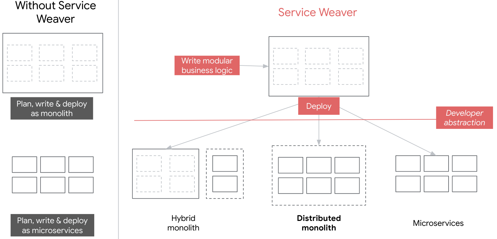
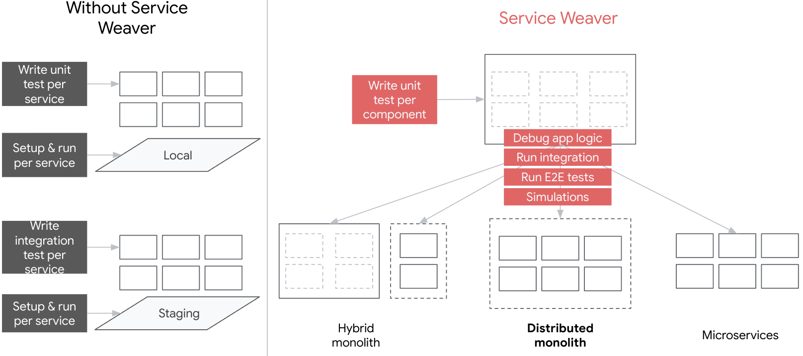
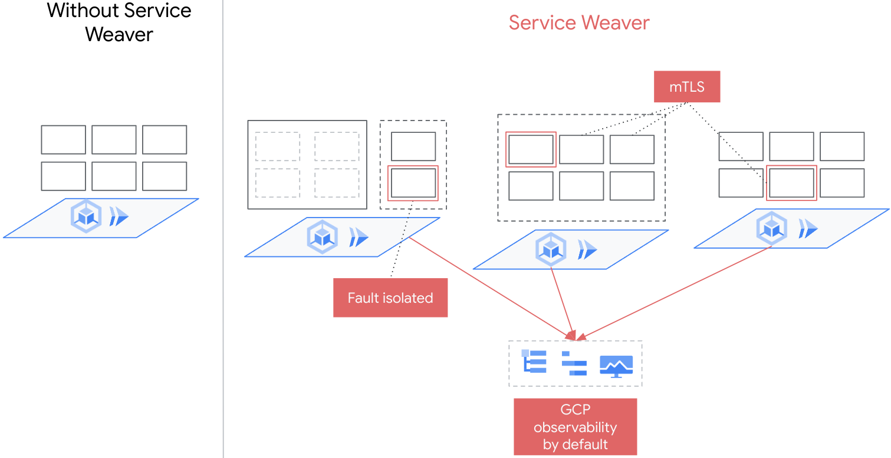
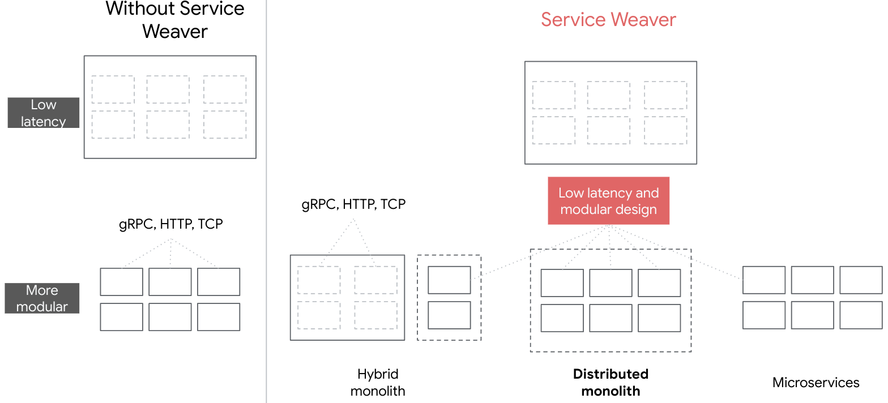
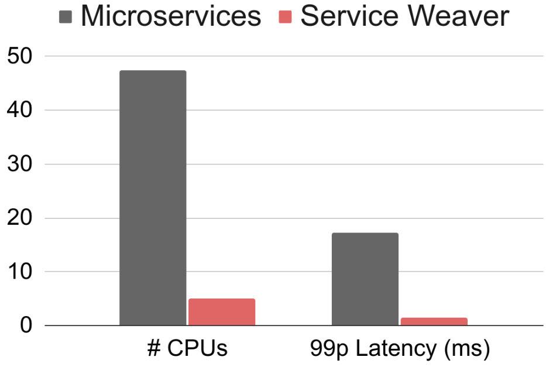

# Improve Cloud Efficiency with Service Weaver

Shane Ouchi

February 8th, 2024

## Overview

<b><i>
📝 Service Weaver provides a simplified, safe and scalable way to improve
backend cloud application efficiency for organizations looking to reduce their
cloud spend.</i></b>

Currently, organizations top challenge is [managing cloud spending][1] with IT leaders
expecting [31% of their operating costs][2] going to the cloud and over [⅔ expecting
YoY increases in cloud spending][2]. One way that organizations can reduce their cloud
spending is by improving the efficiency of developing and maintaining their cloud
applications. Organizations can evaluate three key areas of inefficiencies:

1. Development overhead that negatively impacts feature velocity;
2. IT burden to setup and maintain apps for secure, reliable environments;
3. Compute waste that over-allocates compute resources needed to run globally
available applications.

Service Weaver provides an effective development solution that can holistically
improve these efficiency challenges across the board.

## Simplify development overhead

> Service Weaver can simplify development overhead with a flexible, easy-to-use
> framework that enables development teams to focus on providing differentiating value.

Organizations continue to focus on making teams more effective at balancing
engineering productivity, product quality and differentiating features. Microservices
have made this more difficult by adding overhead for development teams, who increasingly
spend their time on planning, testing, tech debt and incident response.

According to the most recent [Go Developer survey][3], "testing and debugging [is]
the biggest challenge when writing microservice-based applications, followed by
operational complexity." Teams also report high upfront cognitive load on
architectural design decisions to meet evolving production app environment
specifications, which usually results in accumulated tech debt. Platform/IT teams
continue deepening investments in developer tools (e.g. [Backstage][backstage],
[Argo][argo], [Git][git]) and homegrown platforms to make operator teams more
productive in the cloud.

Service Weaver can complement the developer productivity ecosystem with a flexible
framework that enables teams to minimize upfront architectural decisions (*Figure 1*),
conduct comprehensive integration / E2E tests locally (*Figure 2*), and deploy
scalable apps on containerized runtimes (e.g. [GKE][gke], [EKS][eks], [Cloud Run][cloudrun]). Teams have
the choice to deploy applications with minimal upfront environment configurations
to focus on business logic and maximize feature velocity. As application traffic
patterns grow and change, developers can dynamically update the application
configuration with minimal need to refactor, re-test or re-deploy app version
changes that impact underlying application architecture.

 

**Figure 1**: *Service Weaver removes the upfront cognitive load of planning
monolith or microservice architecture.*

 

**Figure 2**: *Service Weaver reduces test toil associated with setting up and
managing remote testing infrastructure with comprehensive local testing capabilities.*

## Minimize IT burden

> Service Weaver can help minimize IT burden with a way to bootstrap safe backend
> mesh applications.

Organizations continue to deepen adoption of public cloud platforms (e.g. [GCP][gcp])
to offload IT burden when running reliable applications. Teams need to maintain
feature velocity while meeting organizational security and compliance needs.

One of the [top pain points][4] preventing cloud adoption is simplifying authentication
and security needs while maintaining compliance with regulatory requirements. End
users want confidence that their data is protected in-transit and explicitly used
for intended purposes; while operator teams need simpler ways to remediate incidents
and prevent misuse. Platform / IT teams continue growing the list of networking
tools and policies to make connecting and routing traffic between services more
reliable and secure. This has resulted in a higher IT burden across platform,
operator and development teams.

Service Weaver can minimize IT burden for teams who are looking for an easy-to-use
way to bootstrap a safer app on public cloud platforms. Once apps are bootstrapped,
applications will have default capabilities to:

1. Ensure data in-transit is secure with [mTLS][mtls];
2. Reduce cascading failures with fault isolated components;
3. Automate [IAM][iam], logging and monitoring when deploying to [Google Cloud][gcloud] (*Figure 3*).

Teams can also choose to export data to open-source observability providers such
as [Prometheus][prometheus] and [Grafana][grafana].

**Figure 3**: *Service Weaver provides a reliable, secure way to deploy
applications with fault isolated components, mTLS inter-component communication,
and GCP observability by default.*

## Reduce computing waste

> Service Weaver can help organizations reduce compute waste of a globally-available
> application with better networking and traffic management primitives.

Currently, an estimated [32% of compute resources are wasted][5] with 64% of organizations
focused on maximizing compute resource utilization and 50% removing idle resources.
However, as applications become more distributed, network latency and traffic
imbalances can contribute a larger portion of computing waste that can unknowingly
scale costs.

Organizations need a highly customizable, intuitive way to improve these scaling
inefficiencies depending on the needs of their distributed applications. Currently,
containerized runtimes raise the abstraction layer of computing efficiency to the
pod/container level. They provide operator teams with configuration knobs to
auto-scale based on average pod-level utilization metrics and balance traffic
intra- or inter-region using default pod metrics. Depending on the traffic
distribution through an application, this can still leave a "fat-tail" of pods
that are highly underutilized.

To minimize computing waste, teams need to holistically evaluate:

1. Lower latency networking;
2. Custom load balancing metrics;
3. Improved sharding capabilities;
4. Enhanced aggregation mechanisms for horizontal auto-scaling that optimizes
app-specific configuration.

More importantly, they want to interact with these capabilities from a highly
simplified interface.

Service Weaver provides an easy-to-use framework with built-in primitives to
address scaling inefficiencies with up to 9x reduction in compute waste
out-of-the-box (*Figure 5*). Service Weaver also provides advanced capabilities
e.g. inter-component communication (*Figure 4*) to further evaluate and fine-tune
efficiencies according to your scalability or performance needs to enable operators
to experiment and minimize compute waste with minimal effort.

We plan to go further in-depth on this topic in an upcoming post.

**Figure 4**: *Service Weaver has an advanced inter-component communication
protocol that is up to **3X** faster than [gRPC][grpc].*

 

**Figure 5**: *Benchmarking an 11-microservice [Online Boutique][16] app with a
rewritten 11-component Service Weaver modulith on [GKE][gke] resulted in an overall **9X**
reduction in CPUs when loading ~10K queries per second.  See our [paper][17] for mode
details on our benchmarking.*

## How to get started?

* To get started on your first app, we recommend following this [step-by-step][6] guide.
* To evaluate your application in a staging or production environment, you can
take the [multiprocess executor][7] and [deploy it to Cloud Run][8], [GKE][9] or [Kubernetes][10].

## Learn more about Service Weaver

There are several resources that can help you learn more about how Service Weaver works.
* How Service Weaver [works][11]
* How to implement [deployers][12]
* Check out the [docs][13], [codelab][14] and [FAQs][15]

[1]: https://info.flexera.com/CM-REPORT-State-of-the-Cloud
[2]: https://www.cio.com/article/657832/cios-sharpen-cloud-cost-strategies-just-as-gen-ai-spikes-loom.html
[3]: https://go.dev/blog/survey2023-h2-results
[4]: https://www.youtube.com/watch?v=5qOwYSCb1Gg
[5]: https://info.flexera.com/CM-REPORT-State-of-the-Cloud
[6]: https://serviceweaver.dev/docs.html#step-by-step-tutorial
[7]: https://serviceweaver.dev/docs.html#step-by-step-tutorial-multiprocess-execution
[8]: https://serviceweaver.dev/docs.html#cloud-run
[9]: https://serviceweaver.dev/docs.html#gke
[10]: https://serviceweaver.dev/blog/kubernetes.html
[11]: https://serviceweaver.dev/blog/quick_intro.html
[12]: https://serviceweaver.dev/blog/deployers.html
[13]: https://serviceweaver.dev/docs.html#what-is-service-weaver
[14]: https://serviceweaver.dev/docs.html#codelab
[15]: https://serviceweaver.dev/docs.html#faq
[16]: https://github.com/GoogleCloudPlatform/microservices-demo
[17]: https://dl.acm.org/doi/10.1145/3593856.3595909
[argo]: https://argo-cd.readthedocs.io/en/stable/
[backstage]: https://backstage.io/
[gcloud]: https://cloud.google.com/
[gcp]: https://cloud.google.com/
[grpc]: https://grpc.io/
[git]: https://docs.github.com/en/actions
[gke]: https://cloud.google.com/kubernetes-engine
[eks]: https://docs.aws.amazon.com/eks
[cloudrun]: https://cloud.google.com/run
[grafana]: https://grafana.com/
[iam]: https://cloud.google.com/security/products/iam
[mtls]: https://www.cloudflare.com/learning/access-management/what-is-mutual-tls
[prometheus]: https://prometheus.io/