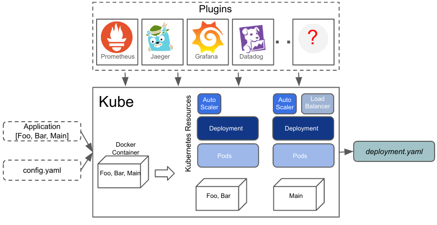

# Service Weaver and Kubernetes

<div class="blog-author">Robert Grandl</div>
<div class="blog-date">November 9, 2023</div>

In this blog post we introduce [`Kube`][kube_doc], a deployer that allows you to
deploy Service Weaver applications in any [Kubernetes][kubernetes] environment,
i.e. [GKE][gke], [EKS][eks], [AKS][aks], [minikube][minikube].

With `Kube`, the user provides an application binary and a configuration file
`config.yaml`. The deployer builds a container image for the application, and
generates Kubernetes resources that enable the application to run in a Kubernetes
cluster.



>With `Kube`:
>* The Kubernetes manifest file to deploy your application is automatically
generated.
>* You control how to run your application (e.g., resource requirements, scaling
>  specifications, volumes).
>* You decide how to export telemetry (e.g., traces to [Jaeger][jaeger], metrics
  to [Prometheus][prometheus], write custom telemetry plugins to export telemetry to
  your favorite observability framework).
>* You can use existing tools to deploy your application (e.g., [kubectl][kubectl],
  CI/CD pipelines like [GitHub Actions][github_actions], [Argo CD][argocd] or
  [Jenkins][jenkins]).

<h3 class="emphasize-title">Hello World!</h3>

To deploy a "Hello, World!" Service Weaver application with the `Kube` deployer,
the user has to write an application config and a deployment config:

```toml
# app_config.toml
[serviceweaver]
binary = "./hello"

# Per component config.
...
```

```yaml
# dep_config.yaml
appConfig: app_config.toml
repo: docker.io/mydockerid

listeners:
  - name: hello
    public: true
```

Then use `weaver kube deploy` to generate the Kubernetes resources needed to
run your application:

```console
$ go build .
$ weaver kube deploy dep_config.yaml
...
Building image hello:ffa65856...
...
Uploading image to docker.io/mydockerid/...
...
Generating kube deployment info ...
...
kube deployment information successfully generated
/tmp/kube_ffa65856.yaml
```

Finally, you can simply deploy your application:

```console
$ kubectl apply -f /tmp/kube_ffa65856.yaml
```

<h3 class="emphasize-title">Configurations</h3>

With `Kube` the user can control how the application is running on Kubernetes. We
identified the top Kubernetes knobs that users typically configure when running
on Kubernetes (based on a survey done by the Go team in 2023 H2), and expose them
in the config. We expose the following knobs:

* [Resources][kubernetes_res] needed to run each container; e.g., the CPU/Mem requests/limits.
* [Scaling specifications][kubernetes_scaling] to control how the pods are scaled up/down; e.g., min and max replicas, metrics to scale, utilization threshold.
* [Volumes][kubernetes_volumes] to mount storage, config maps, secrets, etc.
* [Probes][kubernetes_probes] to monitor the liveness, readiness and startup of the containers.

**Note** that these knobs can be specified for the entire application, or for
a subset of the components.

For example, if the user wants to configure the memory limits for all the running pods,
it can be configured as follows:

```yaml
appConfig: weaver.toml
repo: docker.io/mydockerid

listeners:
- name: hello
  public: true

resourceSpec:
  requests:
    memory: "64Mi"
```

**Note** that if there are other knobs that you want to configure, you can manually
edit the generated Kubernetes manifest file. However, if there are knobs that are
widely used, we can expose them along with the existing knobs in the config.

<h3 class="emphasize-title">Telemetry</h3>

The [`Kube` deployer documentation][kube_doc_telemetry] goes into details how to
export telemetry to your favorite observability framework. To do that, you need
to implement a wrapper deployer on top of the `Kube` deployer using the
[Kube tool][kube_telemetry_api] abstraction. We provide examples on how to export
traces to [Jaeger][jaeger], metrics to [Prometheus][prometheus] and how to visualize
the exported traces and metrics with [Grafana][grafana].

<h3 class="emphasize-title">CI/CD Pipelines</h3>

The `Kube` deployer allows you to deploy your application using your favorite CI/CD
pipeline. [Here][github_actions] is an example on how to integrate with the
[GitHub Actions][gha]. We also integrate with [ArgCD][argocd] and [Jenkins][jenkins].

<h3 class="emphasize-title">Final Thoughts</h3>

To learn more on how to use the `Kube` deployer to run your Service Weaver application
on Kubernetes, check the [`Kube` deployer][kube_doc] documentation. We are eager
to hear your feedback and help us enhance the deployer or, perhaps, contribute
new deployers that can benefit the entire Service Weaver community.

[aks]: https://azure.microsoft.com/en-us/products/kubernetes-service
[argocd]: https://argoproj.github.io/cd/
[component]: https://serviceweaver.dev/docs.html#components
[eks]: https://aws.amazon.com/eks/
[github_actions]: https://github.com/features/actions
[gke]: https://cloud.google.com/kubernetes-engine
[gke_doc]: https://serviceweaver.dev/docs.html#gke
[gha]: https://github.com/features/actions
[grafana]: https://grafana.com/
[jaeger]: https://www.jaegertracing.io/
[jenkins]: https://www.jenkins.io/
[kubernetes]: https://kubernetes.io/
[kubernetes_res]: https://kubernetes.io/docs/concepts/configuration/manage-resources-containers/
[kubernetes_scaling]: https://kubernetes.io/docs/tasks/run-application/horizontal-pod-autoscale/
[kubernetes_probes]: https://kubernetes.io/docs/tasks/configure-pod-container/configure-liveness-readiness-startup-probes/
[kubernetes_volumes]: https://kubernetes.io/docs/concepts/storage/volumes/
[kubectl]: https://kubernetes.io/docs/reference/kubectl/
[kube_doc]: https://serviceweaver.dev/docs.html#kube
[kube_doc_telemetry]: https://serviceweaver.dev/docs.html#kube-telemetry
[kube_telemetry_api]: https://github.com/ServiceWeaver/weaver-kube/blob/main/tool/tool.go
[minikube]: https://minikube.sigs.k8s.io/docs/
[prometheus]: https://prometheus.io
