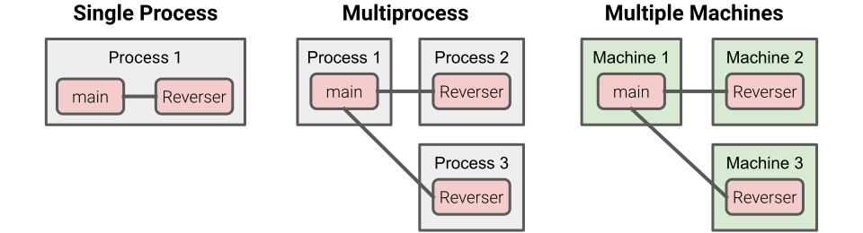

# A Quick Introduction to Service Weaver

<div class="blog-author">Robert Grandl</div>
<div class="blog-date">March 1, 2023</div>

<div style='
    background-color: #FFF6CF;
    border-radius: 16px;
    padding:0.7em;
    margin-top: 1rem;
    border-width: 1px;
    border-style: none;'
>
<p style='
    font-size: 1.2em;
    text-align: left;
    margin-top: 0.5em;
    color: #e06666'>
📝 <i><b>Write your application as a modular binary. Deploy it as a set
of microservices!</b></i></p>

<p style='text-align: justify; margin-bottom: 0.5em;'>
<b>TL;DR:</b> Service Weaver is a programming framework for writing, deploying, and
managing distributed applications in Go. With Service Weaver, you write your
application like it is a traditional, single-process Go executable that runs on
your local machine. Then, you deploy it to the Cloud, and the framework breaks
it down into a set of connected microservices and integrates it with the cloud
provider (e.g., monitoring, tracing, logging).</p>
</div>

## Why Service Weaver?

When we write an application that runs on our laptop, we rely on traditional
programming concepts such as functions and interfaces, and our main challenges
are centered around the application business logic.

When an application outgrows the constraints of a single machine, however, and
it is time to deploy it in the cloud, the above traditional programming model
breaks down. Our beautiful application ends up a nightmare of broken-down
business logic interspersed with networking calls, cloud integration points,
and configuration files.

<h3 class="emphasize-title">Oh no, it is time to integrate with the cloud!!!</h3>

Our cloud integration journey requires us to first learn about configuring and
building containers for our application binary. Next, we learn about cloud
tooling (e.g., gcloud, kubectl) and how to configure the application in the
cloud (e.g., Kubernetes YAML). Finally, we add appropriate cloud service API
calls to the application.

These steps are often cumbersome, time-consuming, and difficult to understand,
even for the more experienced developers. Even then, we still have to handle
many challenges related to the cloud's distributed nature. For example, we have
to implement functionality related to service discovery, security, load
balancing, and cross-service communication (e.g., JSON encoding/decoding,
HTTP servers).

Hence, our application code becomes more complicated and we slowly get
distracted from our initial focus: application business logic.

>With Service Weaver, your focus is mostly on the application business logic.
>Service Weaver takes care of cloud configuration and integration with the cloud
>provider.


<h3 class="emphasize-title">Huh, what are microservices and do we really need them?</h3>

Once we migrate our application to the cloud, we often ask ourselves how to
structure the application code due to the distributed nature of the cloud.

A widely adopted strategy is to split the application binary into microservices.
This split has multiple benefits, such as more efficient application scaling
behavior, reduced error blast radius, separate security domains, and well
established module boundaries.

On the flip side, finding the right boundaries to perform the split isn't
trivial. For example, should we split based on resource use, organizational
reasons, the structure of the data, or provisioning for future growth? Hence,
we often end up with more microservices than we need, resulting in additional
failure points, greater latency, and an inherently more difficult application
to develop, deploy, and manage.

>With Service Weaver, you are encouraged to split the application into as many
>components as desired. During deployment, you easily configure which components
>run together in the same microservice and which run in separate microservices.

<h3 class="emphasize-title">OMG, how do we manage our application?</h3>

As mentioned above, the complex nature of the cloud leads to a more difficult
application to develop, deploy, and manage.

For example, by splitting the application code into microservices, we end up
with multiple application binaries, one per microservice. Instead of a single
deployment, we end up running N different CI/CD pipelines to get N microservices
deployed. Instead of a single configuration file, we end up writing a separate
configuration file for each microservice, which makes it easy to omit setting up
certain parameters, or even worse, set the wrong values.

Since microservice binaries are deployed independently, we have to write our
application with the assumption that each microservice runs at a different code
version. This complicates development and requires careful deployment strategies
to mitigate risk. It also complicates testing, since it requires testing all
possible combinations of microservice versions and their interactions.

Finally, since our application logic is split across multiple binaries, which
also contain cloud-specific calls, end-to-end testing is challenging to do
locally. We are more likely to rely on detecting errors when deploying the
application services, as opposed to running end-to-end tests.

>With Service Weaver, you deploy and manage a single application binary. The
>fact that it runs as separate microservices in the cloud is an implementation
>detail: all of your tooling preserves the impression of a single application
>binary. You can also easily run and test your application locally, before
>deploying it in the cloud.

<h3 class="emphasize-title">Finally it works. Oh, performance?</h3>

Once we got our microservice-based application to run correctly in the cloud,
we realize that its performance is terrible. We do some digging and find out
that most of our compute cycles are spent serializing and sending data across
the network. We don't want to reinvent the network transport and serialization
protocols, so we just leave the application as is. It costs us more to run, but
we don't want to invest additional engineering time in optimizing performance.

>Service Weaver uses custom serialization and transport protocols that are up to
>three times more cost effective than the best industry solutions (i.e., gRPC
>and protocol buffers). This means your cloud bill is significantly reduced and
>you can double-down on your focus on the application logic.

## How to Write an Application with Service Weaver?

The core abstraction of Service Weaver is a *component*, an actor-like unit of
computation. A component is represented as a regular Go interface, and
components interact with each other by calling the methods defined by these
interfaces. For example, here is a simple Reverser component that, as the name
suggests, reverses strings.

```go
// The interface of the Reverser component.
type Reverser interface {
    Reverse(context.Context, string) (string, error)
}

// The implementation of the Reverser component.
type reverser struct{
    weaver.Implements[Reverser]
}

func (r reverser) Reverse(_ context.Context, s string) (string, error) {
    runes := []rune(s)
    n := len(runes)
    for i := 0; i < n/2; i++ {
        runes[i], runes[n-i-1] = runes[n-i-1], runes[i]
    }
    return string(runes), nil
}
```

Other components can interact with the Reverser component as simply as calling
its methods:

```go
reversed, err := reverser.Reverse(ctx, "Hello, World!")
```

The main advantage of components is that they aren't tied to OS processes.
Despite the fact that we didn’t write any networking or serialization code,
components can run in separate processes or on completely different machines.
Here is a diagram illustrating this concept:



When two components run together in a single process, method calls between them
are executed as regular Go method calls. When two components run in separate
processes, method calls between them are executed as RPCs.

Splitting your application into a number of components is a lot like splitting
your application into a number of microservices. It encourages clear abstraction
boundaries, it allows different components to scale independently, and so on.
However, components avoid a lot of [the drawbacks of microservices][drawbacks]:

* All components run at the same version. You don’t have to reason about subtle
cross-version compatibility,
[one of the leading causes of system failures in the wild][failures].
* You can run and test your entire application as easily as running `go run` and
`go test`. You don’t have to figure out how to build and run `n` different
microservices, all in the right order with the right environment and
dependencies.
* Splitting and merging microservices can be painful. This leads people to avoid
microservices entirely or to split their application into an unnecessarily large
number of microservices out of fear that “it will be harder to split later”.
Service Weaver makes it trivial to add new components or merge two components
together. You don’t have to worry about getting component boundaries perfect.

## How to Manage my Service Weaver Application?

Service Weaver provides mechanisms to easily test, debug and deploy new versions
of your application, without the headaches and the burden a cloud developer has
to face today.

<h3 class="emphasize-title">Deploying</h3>

Service Weaver makes it as easy to run an application on the cloud as it is to
run it locally on your laptop:

```console
$ go run .                           # Run locally, in the same OS process.
$ weaver multi deploy weaver.toml    # Run locally, in multiple OS processes.
$ weaver gke deploy weaver.toml      # Run in the cloud.
```

<h3 class="emphasize-title">Configuration</h3>

Service Weaver requires a tiny amount of configuration to deploy to the cloud.
The Online Boutique demo application has over 1,500 lines of configuration.
The same app written with Service Weaver has less than 10:

```toml
[weaver]
binary = "./online_boutique"
rollout = "6h"

[gke]
regions = ["us-west1", "us-east2"]
listeners.boutique = {public_hostname = "online-boutique.net"}
```

We just need to specify the application binary, the duration of the rollout,
the regions where the application should be deployed, and which network
listeners should be publicly accessible. That’s it.

<h3 class="emphasize-title">Rolling out New Versions</h3>

Serving systems evolve over time. Whether you're fixing bugs or adding new
features, it is inevitable that you will have to roll out a new version of your
system to replace the currently running version. To maintain the availability
of their systems, people typically perform rolling updates.

During a rolling update, nodes running the old version of the code will have to
communicate with other nodes running the new version of the code. In
[Understanding and Detecting Software Upgrade Failures in Distributed Systems][understanding],
Zhang et al. perform a case study of 123 failed updates in 8 widely used
systems. They found that the majority of failures were caused by the
interactions between multiple versions of a system:

>About two thirds of update failures are caused by interaction between two
>software versions that hold incompatible data syntax or semantics assumptions.

Service Weaver takes a different approach to rollouts. It ensures that client
requests are executed entirely within a single version of a system. A component
in one version will never communicate with a component in a different version.
This eliminates the leading cause of update failures, allowing you to roll out
new versions of your application safely and with less headache.

When you make changes to your application, simply rebuild and rerun it. Service
Weaver will take care of gradually shifting traffic from the old version to the
new version.

<h3 class="emphasize-title">Instrumenting</h3>

Service Weaver provides libraries for logging, metrics, and tracing. This
telemetry is automatically integrated into the environment where an application
is deployed. For example, if we deploy an application on Google Cloud, logs are
automatically exported to [Google Cloud Logging][cloud_logging], metrics are
automatically exported to the [Google Cloud Monitoring][cloud_metrics], traces
are uploaded to [Google Cloud Tracing][cloud_trace]. Here is an example of how
to add a counter to the Reverser component:

```go
var reverseCount = metrics.NewCounter(
    "reverse_count",
    "The number of times Reverser.Reverse has been called",
)

func (reverser) Reverse(_ context.Context, s string) (string, error) {
    reverseCount.Add(1.0)
    // ...
}
```

<h3 class="emphasize-title">Testing</h3>

The development cycle of a microservices based application is slow. If you want
to iterate on an application’s business logic, you have to install heavy cloud
dependencies, install complex testing frameworks, or deploy the application to
the cloud. All of these approaches take a significant toll on development
velocity.

Service Weaver applications, on the other hand, can be built, run, and tested
like regular Go programs. You can make a change to your application, and simply
run `go run .` to see the effect of the changes immediately. Additionally,
Service Weaver provides a `weavertest` package that makes writing end-to-end
tests as easy as writing unit tests.

## High-Performance

Service Weaver applications are not only easier to write, run, and manage;
they’re also faster.

>We found out that Service Weaver improves application latency by 15x and reduces
>VM costs by 9x when compared to a typical microservices solution built on top
>of gRPC and protocol buffers.

<h3 class="emphasize-title">No RPCs, No Protos, An Efficient Network Protocol</h3>

The fact that all application components run at the same code version allows
Service Weaver to heavily optimize its serialization and communication
protocols. For example, co-located components communicate via direct method
calls; components that aren't co-located communicate using language native
data-structures and a custom RPC protocol. Both the serialization and the RPC
protocols are more efficient than gRPC and Protocol Buffers because they avoid
the overhead needed to resolve versioning issues.

<h3 class="emphasize-title">Efficient Autoscaling and Load Balancing</h3>

Another benefit of running all components at the same version in a single
application binary is that Service Weaver has a bird’s-eye view into the
application and the interactions between components. This allows Service Weaver
to make intelligent component placement decisions and employ efficient
autoscaling solutions.

<h3 class="emphasize-title">Flexible Placement</h3>

Service Weaver provides flexible component placement. For example, we can
co-locate two components that communicate often with each other in the same
process or machine. Conversely, we can place components with the same resource
bottleneck on different machines to improve resource utilization or to improve
fault-isolation. Service Weaver enables us to do all this with a single-line
config change.

<h3 class="emphasize-title">Sharding</h3>

Service Weaver enables you to shard application requests across component
replicas with application specific sharding keys. This allows you to more
intelligently spread load across component replicas. The affinity also improves
cache efficiency, which lowers application latency and reduces hotspots.

[drawbacks]: http://blogs.newardassociates.com/blog/2023/you-want-modules-not-microservices.html
[failures]: https://scholar.google.com/scholar?cluster=4116586908204898847
[understanding]: https://scholar.google.com/scholar?cluster=4116586908204898847
[cloud_logging]: https://cloud.google.com/logging
[cloud_metrics]: https://cloud.google.com/monitoring/
[cloud_trace]: https://cloud.google.com/trace
