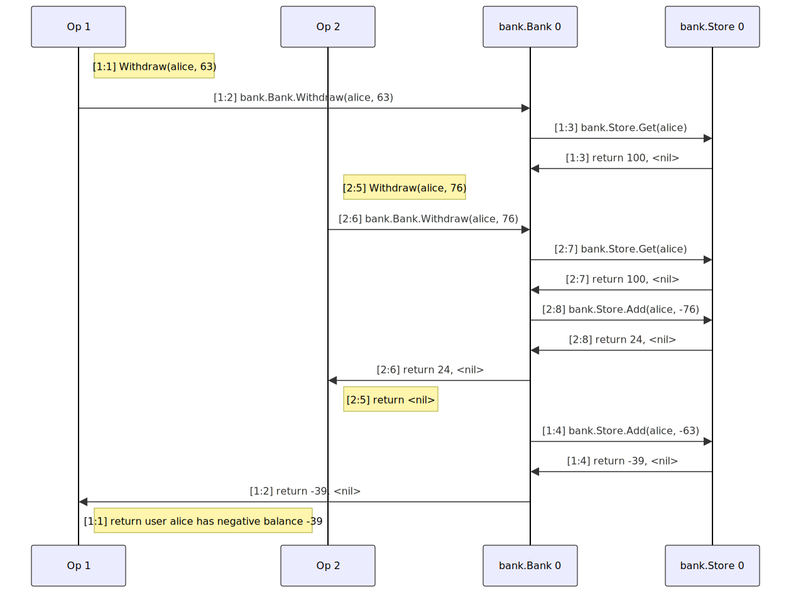

# Lower Test Toil With Better Local Testing

[Service Weaver][tutorial] is a programming framework that makes it easy to
write, test, and deploy distributed applications. In [previous blog
posts][blog], we discussed how to write and deploy Service Weaver applications.
In this blog post, we'll focus on testing. Specifically, we'll explore

- how Service Weaver lets you **unit test** system components using regular Go
  unit tests;
- how Service Weaver makes it significantly easier to write **integration
  tests** that would otherwise be slow and brittle; and
- how Service Weaver implements an advanced form of **randomized testing**
  called deterministic simulation that can find rare bugs that only emerge in
  pathological cases.

These three types of testing&mdash;unit testing, integration testing, and
randomized testing&mdash;all fall on a spectrum trading off test complexity and
test coverage. All three types of tests are valuable; they complement one
another.

## 1. Unit Testing

Service Weaver has a [`weavertest` package][unit_testing] that makes it easy to
**unit test** [components][components]. For example, consider the following
`Adder` component:

```go
type Adder interface {
    Add(context.Context, int, int) (int, error)
}

type adder struct {
    weaver.Implements[Adder]
}

func (*adder) Add(_ context.Context, x, y int) (int, error) {
    return x + y, nil
}
```

We can use the `weavertest` package to unit test the `Adder` component using
[idiomatic Go unit tests][go_testing]:

```go
package main

import (
    "context"
    "testing"

    "github.com/ServiceWeaver/weaver"
    "github.com/ServiceWeaver/weaver/weavertest"
)

func TestAdd(t *testing.T) {
     runner := weavertest.Local
     runner.Test(t, func(t *testing.T, adder Adder) {
         got, err := adder.Add(context.Background(), 1, 2)
         if err != nil {
             t.Fatal(err)
         }
         if want := 3; got != want {
             t.Fatalf("got %q, want %q", got, want)
         }
     })
}
```

In the code above, `weavertest.Local` is a unit test runner that runs all
components locally. The call to `runner.Test` executes the provided unit
test, instantiating all the necessary components (i.e. `Adder`).

Because unit tests written with the `weavertest` package are standard Go unit
tests, you can run them (as you would any unit test) with `go test`:

```console
$ go test
PASS
ok      github.com/ServiceWeaver/adder 0.001s
```

## 2. Integration Testing

While unit tests are good for testing small pieces (or units) of an application
in isolation, **integration tests** test an application in its entirety.
Unfortunately, integration testing microservice based applications can be
toilsome.

To integration test an application with `n` microservices, a testing framework
needs to build, run, and interconnect all `n` microservice binaries. Plus, the
integration tests themselves have to be written in yet another binary that
interacts with the system over the network. Overall, integration testing is
historically slow, brittle, and tedious.

Consider [Online Boutique][onlineboutique], as an example. Online Boutique is an
example microservice based application that implements [a simple e-commerce
app][onlineboutique_demo] where users browse items, add items to their cart,
and check out. Online Boutique consists of eleven microservices written in five
different programming languages. [Running the application
locally][onlineboutique_local] requires 4 CPUs, 4.0 GiB of memory, 32 GB of disk
space, a locally running Kubernetes cluster, can take upwards of 20 minutes, and
is configured via over 8000 lines of YAML and Dockerfiles. And this is just to
*run* the application. Integration testing it would require even more effort.

In contrast to this, we [ported Online Boutique to Service
Weaver][sw_onlineboutique] and are able to integration test the application with
a single command and zero lines of config in less than a tenth of a second. To
do so, we again use the `weavertest` package:

```go
package main

import (
    "context"
    "testing"
    "time"

    "github.com/ServiceWeaver/onlineboutique/cartservice"
    "github.com/ServiceWeaver/onlineboutique/checkoutservice"
    "github.com/ServiceWeaver/onlineboutique/paymentservice"
    "github.com/ServiceWeaver/onlineboutique/productcatalogservice"
    "github.com/ServiceWeaver/onlineboutique/shippingservice"
    "github.com/ServiceWeaver/weaver/weavertest"
)

func TestPurchase(t *testing.T) {
    runner := weavertest.Local
    runner.Test(t, func(
        t *testing.T,
        catalog productcatalogservice.ProductCatalogService,
        cart cartservice.CartService,
        checkout checkoutservice.CheckoutService,
    ) {
        // List all products.
        ctx := context.Background()
        products, err := catalog.ListProducts(ctx)
        if err != nil {
            t.Fatal(err)
        }

        // Add one of every product to our cart.
        const userID = "sundar_pichai"
        for _, product := range products {
            item := cartservice.CartItem{ProductID: product.ID, Quantity: 1}
            if err := cart.AddItem(ctx, userID, item); err != nil {
                t.Fatal(err)
            }
        }

        // Place the order.
        order := checkoutservice.PlaceOrderRequest{
            UserID:       userID,
            UserCurrency: "USD",
            Address: shippingservice.Address{
                StreetAddress: "1600 Amphitheatre Parkway",
                City:          "Mountain View",
                State:         "CA",
                Country:       "USA",
                ZipCode:       94043,
            },
            Email: "sundar@google.com",
            CreditCard: paymentservice.CreditCardInfo{
                Number:          "4432-8015-6152-0454",
                CVV:             672,
                ExpirationYear:  2025,
                ExpirationMonth: time.January,
            },
        }
        if _, err := checkout.PlaceOrder(ctx, order); err != nil {
            t.Fatal(err)
        }
    })
}
```

The integration test lists all available products using the catalog service,
adds one of every product to a cart using the cart service, and checks out using
the checkout service. Service Weaver automatically initializes all these
services, as well as the other services on which they depend (e.g., shipping
service, email service, payment service, etc.). Moreover, Service Weaver reduces
the tedium of writing integration tests by allowing you to use language native
types and method calls to interact with various services.

We can run this integration test as easily as running `go test`:

```console
$ go test
PASS
ok      github.com/ServiceWeaver/onlineboutique 0.026s
```

In addition to using the `weavertest.Local` runner, which runs all components
locally in a single process, we can also use

- the `weavertest.RPC` runner, which forces components to interact via RPC, and
- the `weavertest.Multi` runner, which runs every component in a separate
  OS process.

Some components may be too slow or cumbersome to use in a test. In these cases,
Service Weaver allows you to replace the component with a [**fake**][fakes]. For
example, we can write a fake implementation of the product catalog service that
uses a fixed in-memory set of products:

```go
type Product = productcatalogservice.Product

type fakeCatalog struct {
    products []Product
}

func (f *fakeCatalog) ListProducts(context.Context) ([]Product, error) {
    return f.products, nil
}

func (f *fakeCatalog) GetProduct(ctx context.Context, id string) (Product, error) {
    for _, p := range f.products {
        if p.ID == id {
            return p, nil
        }
    }
    return Product{}, productcatalogservice.NotFoundError{}
}

func (f *fakeCatalog) SearchProducts(context.Context, string) ([]Product, error) {
	panic("unimplemented")
}
```

Then, we can update our integration test to use a `fakeCatalog` instead of the
real product catalog service component.

```go
func TestPurchaseWithFakeCatalog(t *testing.T) {
    catalog := &fakeCatalog{
        products: []Product{
            {
                ID:          "0",
                Name:        "Noogler Hat",
                Description: "A colorful hat given to new Googlers.",
                PriceUSD:    money.T{CurrencyCode: "USD", Units: 42},
            },
        },
    }
    fake := weavertest.Fake[productcatalogservice.ProductCatalogService](catalog)
    runner := weavertest.Local
    runner.Fakes = append(runner.Fakes, fake)
    runner.Test(t, func(
        t *testing.T,
        catalog productcatalogservice.ProductCatalogService,
        cart cartservice.CartService,
        checkout checkoutservice.CheckoutService,
    ) {
        // Testing code goes here.
        ...
    })
}
```

## 3. Randomized Testing

When you write a unit test or integration test, you write some code and check
that it executes in the way you expect. For example, to test a `Reversed([]byte)
[]byte` function, you might check that

- `Reversed([]byte{})` is `[]byte{}`,
- `Reversed([]byte{1})` is `[]byte{1}`,
- `Reversed([]byte{1, 2})` is `[]byte{2, 1}`, and so on.

Unit and integration tests are thus limited to only test the behaviors and
corner cases that you can think of and have the patience to write down.

With randomized **property-based tests**, on the other hand, you specify a
property of your code that should always hold and then test the property on
millions of randomly generated examples. For example, we can test that the
`Reversed` function is [involutive][]&mdash;i.e. that `Reversed(Reversed(x)) ==
x`&mdash;by writing a [fuzz test][fuzzing] that tests the property on randomly
generated byte slices:

```go
func FuzzReversedIsInvolutive(f *testing.F) {
    f.Fuzz(func(t *testing.T, want []byte) {
        got := Reversed(Reversed(want))
        if !slices.Equal(want, got) {
            t.Fatalf("got %v, want %v", got, want)
        }
    })
}
```

Service Weaver allows you to apply randomized property-based testing to entire
applications by checking that properties of an application always hold, even
when we run random operations on random inputs in the face of random failures
and random interleavings. For distributed systems, this kind of randomized
property-based testing is especially valuable, as many failure inducing corner
cases are extremely pathological and hard to think of. Even well studied and
heavily scrutinized protocols [tend to have subtle bugs][protocol_bugs].

Service Weaver implements a type of randomized testing called [**deterministic
simulation**][deterministic_simulation], popularized by
[FoundationDB][foundationdb]. Deterministic simulation has the ability to (1)
find rare, buggy executions of a system and (2) deterministically replay these
executions. This allows you to step through a buggy execution, understand the
bug, write a bug fix, and verify that the fix eliminates the bug.

To deterministically simulate a system *without* Service Weaver, you'll have to
implement a simulator from scratch. There aren't any existing tools that make it
easy to perform deterministic simulation. Service Weaver, on the other hand,
ships with a full deterministic simulation implementation.

### Deterministic Simulation

Deterministic simulation requires three things: a system to test, a workload,
and a set of invariants.

1. The **system to test** is self-explanatory. With Service Weaver, these are
   Service Weaver applications. As an example, consider a banking application
   which allows users to deposit and withdraw money from their accounts.

2. You must specify a set of operations to run against the system.  Continuing
   our banking example, you could define an operation to deposit a random amount
   of money into a random account and an operation to withdraw a random amount
   of money from a random account. Together, the set of operations is called a
   **workload**.

3. You must define a set of system **invariants**. These are properties about
   your system that must always hold. For the banking application, you might
   define the invariant that a user should never have a negative bank account
   balance.

Given a system to test, a workload, and a set of invariants, a deterministic
simulator runs millions of random operations&mdash;drawn from the
workload&mdash;against the system, checking that the invariants always hold.
While the simulator runs operations, it also performs all sorts of nefarious
actions like injecting network delays, re-ordering messages, and artificially
failing services.

While these executions are randomized and have injected failures, they are also
deterministic. When a simulator discovers an invariant violation, it can report
the exact sequence of events that led to the violation and can replay the
sequence on command. This allows you to debug what went wrong in your system,
fix it, and then replay the failure inducing execution to ensure your fix is
correct.

A simulator can even simplify a failing execution to the smallest subsequence of
events that leads to an invariant violation, a process known as minimization.
This makes it easier to understand what *caused* an invariant violation while
ignoring the unrelated events that just happened to be thrown in the mix.

### Banking Example

Now, let's look at how to, concretely, perform deterministic simulation with
Service Weaver. We implement and test the banking example presented above. We
begin with a `Store` component that persists a mapping from strings to integers:

```go
// A Store is a persistent map from strings to integers, like a map[string]int.
type Store interface {
    // Get gets the value of the provided key.
    Get(ctx context.Context, key string) (int, error)

    // Add atomically adds the provided delta to the provided key and returns
    // the resulting sum. Note that delta can be positive or negative. For
    // example, Add(ctx, "foo", 10) adds 10 to "foo", while Add(ctx, "foo",
    // -10) subtracts 10 from "foo".
    Add(ctx context.Context, key string, delta int) (int, error)
}
```

The `Store` component can be implemented using any persistent data store, like a
relational database, for example. We omit the implementation for brevity. Next,
we have a `Bank` component with an API to deposit and withdraw money:

```go
// A Bank is a persistent collection of user bank account balances.
type Bank interface {
    // Deposit adds the provided amount to the provided user's bank account
    // balance and returns the balance after the deposit.
    //
    // Deposit returns an error if the provided amount is negative.
    Deposit(ctx context.Context, user string, amount int) (int, error)

    // Withdraw subtracts the provided amount from the provided user's bank
    // account balance and returns the balance after the withdrawal.
    //
    // Withdraw returns an error if the provided amount is negative or if the
    // user's balance is less than the withdrawal amount.
    Withdraw(ctx context.Context, user string, amount int) (int, error)
}
```

We implement the `Bank` using the `Store` component as follows:

```go
type bank struct {
    weaver.Implements[Bank]
    store weaver.Ref[Store]
}

func (b *bank) Deposit(ctx context.Context, user string, amount int) (int, error) {
    if amount < 0 {
        return 0, fmt.Errorf("deposit negative amount: %d", amount)
    }
    return b.store.Get().Add(ctx, user, amount)
}

func (b *bank) Withdraw(ctx context.Context, user string, amount int) (int, error) {
    if amount < 0 {
        return 0, fmt.Errorf("withdraw negative amount: %d", amount)
    }
    balance, err := b.store.Get().Get(ctx, user)
    if err != nil {
        return 0, err
    }
    if amount > balance {
        return 0, fmt.Errorf("insufficient funds (%d) to withdraw %d", balance, amount)
    }
    return b.store.Get().Add(ctx, user, -amount)
}
```

Note that the `Withdraw` method is careful not to withdraw more money than a
user has in their account. A user should never have a negative bank account
balance.

Next, we test our banking app using Service Weaver's [`sim` package](TODO). We
begin by writing a fake implementation of the `Store` component to simplify
testing:

```go
type fakestore struct {
    mu     sync.Mutex
    values map[string]int
}

func (f *fakestore) Get(_ context.Context, key string) (int, error) {
    f.mu.Lock()
    defer f.mu.Unlock()
    return f.values[key], nil
}

func (f *fakestore) Add(_ context.Context, key string, delta int) (int, error) {
    f.mu.Lock()
    defer f.mu.Unlock()
    f.values[key] += delta
    return f.values[key], nil
}
```

Next, we define a workload consisting of random deposits and withdrawals. With
the `sim` package, a workload is implemented as a struct that implements the
[`sim.Workload`](TODO) interface.

```go
// BankWorkload is a workload that performs random deposits and withdrawals.
type BankWorkload struct {
    bank weaver.Ref[bank.Bank]
}
```

The `sim.Workload` interface includes an `Init` method where the workload can
register fake component implementations and random generators.

```go
// Init implements the sim.Workload interface.
func (c *BankWorkload) Init(r sim.Registrar) error {
    // Register generators that deposit and withdraw between $0 and $100 from
    // alice and bob's bank accounts.
    user := sim.OneOf("alice", "bob")
    amount := sim.Range(0, 100)
    r.RegisterGenerators("Deposit", user, amount)
    r.RegisterGenerators("Withdraw", user, amount)

    // Register a fake store with $100 in alice and bob's accounts initially.
    store := &fakestore{values: map[string]int{"alice": 100, "bob": 100}}
    r.RegisterFake(sim.Fake[bank.Store](store))
    return nil
}
```

Finally, we implement the actual workload operations, `Deposit` and `Withdraw`,
as methods of our workload. During simulation, the arguments to the methods are
generated by the random generators registered in the `Init` method. If an
operation ever detects an invariant violation, it returns an error. For this
example, `Withdraw` returns an error if it ever detects a negative bank account
balance.

```go
// Deposit is an operation that deposits the provided amount in the provided
// user's bank account balance.
func (c *BankWorkload) Deposit(ctx context.Context, user string, amount int) error {
    // NOTE that we ignore errors because it is expected that the simulator
    // will inject errors every once in a while.
    c.bank.Get().Deposit(ctx, user, amount)
    return nil
}

// Withdraw is an operation that withdraws the provided amount from the
// provided user's bank account balance.
func (c *BankWorkload) Withdraw(ctx context.Context, user string, amount int) error {
    balance, err := c.bank.Get().Withdraw(ctx, user, amount)
    if err != nil {
        // NOTE that we ignore errors because it is expected that the simulator
        // will inject errors every once in a while.
        return nil
    }
    if balance < 0 {
        // A bank account balance should never be negative.
        return fmt.Errorf("user %s has negative balance %d", user, balance)
    }
    return nil
}
```

Finally, we write a test to run the simulation, which we can run with `go test`:

```go
func TestBank(t *testing.T) {
    s := sim.New(t, &BankWorkload{}, sim.Options{})
    r := s.Run(10 * time.Second)
    if r.Err != nil {
        t.Log(r.Mermaid())
        t.Fatal(r.Err)
    }
}
```

If we run this test, we'll see it fails!

```go
go test -v
=== RUN   TestBank
    simulator.go:288: Simulating workload *bank_test.BankWorkload for 10s.
    simulator.go:478: Executing 0 graveyard entries.
    simulator.go:498: Done executing graveyard entries.
    simulator.go:382: Executing with 240 executors.
    simulator.go:315: Error found after 135,022 ops across 133,504 executions in 988ms (135,044.16 execs/s, 136,579.67 ops/s).
    simulator.go:326: Failing input written to testdata/sim/TestBank/62af1e314c4de114.json.
    bank_test.go:103: sequenceDiagram
            participant op1 as Op 1
            participant op2 as Op 2
            participant github.com/ServiceWeaver/weaver/sim/internal/bank/Bank0 as bank.Bank 0
            participant github.com/ServiceWeaver/weaver/sim/internal/bank/Store0 as bank.Store 0
            note right of op1: [1:1] Withdraw(alice, 58)
            op1->>github.com/ServiceWeaver/weaver/sim/internal/bank/Bank0: [1:2] bank.Bank.Withdraw(alice, 58)
            github.com/ServiceWeaver/weaver/sim/internal/bank/Bank0->>github.com/ServiceWeaver/weaver/sim/internal/bank/Store0: [1:3] bank.Store.Get(alice)
            github.com/ServiceWeaver/weaver/sim/internal/bank/Store0->>github.com/ServiceWeaver/weaver/sim/internal/bank/Bank0: [1:3] return 100, <nil>
            note right of op2: [2:5] Withdraw(alice, 45)
            op2->>github.com/ServiceWeaver/weaver/sim/internal/bank/Bank0: [2:6] bank.Bank.Withdraw(alice, 45)
            github.com/ServiceWeaver/weaver/sim/internal/bank/Bank0->>github.com/ServiceWeaver/weaver/sim/internal/bank/Store0: [2:7] bank.Store.Get(alice)
            github.com/ServiceWeaver/weaver/sim/internal/bank/Store0->>github.com/ServiceWeaver/weaver/sim/internal/bank/Bank0: [2:7] return 100, <nil>
            github.com/ServiceWeaver/weaver/sim/internal/bank/Bank0->>github.com/ServiceWeaver/weaver/sim/internal/bank/Store0: [1:4] bank.Store.Add(alice, -58)
            github.com/ServiceWeaver/weaver/sim/internal/bank/Store0->>github.com/ServiceWeaver/weaver/sim/internal/bank/Bank0: [1:4] return 42, <nil>
            github.com/ServiceWeaver/weaver/sim/internal/bank/Bank0->>op1: [1:2] return 42, <nil>
            note right of op1: [1:1] return <nil>
            github.com/ServiceWeaver/weaver/sim/internal/bank/Bank0->>github.com/ServiceWeaver/weaver/sim/internal/bank/Store0: [2:8] bank.Store.Add(alice, -45)
            github.com/ServiceWeaver/weaver/sim/internal/bank/Store0->>github.com/ServiceWeaver/weaver/sim/internal/bank/Bank0: [2:8] return -3, <nil>
            github.com/ServiceWeaver/weaver/sim/internal/bank/Bank0->>op2: [2:6] return -3, <nil>
            note right of op2: [2:5] return user alice has negative balance -3

    bank_test.go:104: Unexpected success
--- FAIL: TestBank (0.99s)
FAIL
exit status 1
FAIL    github.com/ServiceWeaver/weaver/sim/internal/bank       1.015s
```

The simulator writes the failing execution to a file
(`testdata/sim/TestBank/62af1e314c4de114.json` in this example). The next time
you run `go test`, the simulator will automatically parse and replay the failing
execution. The simulator also prints out a [Mermaid diagram][mermaid] of the
failing execution (which you can view using [mermaid.live](https://mermaid.live/)):

<figure>
  
</figure>

The diagram shows two operations that race to withdraw money from Alice's
account. The first operation sees Alice's balance at $100, concluding that a
withdrawal of $63 is safe. However, before it can actually perform the
withdrawal, the second operation starts executing. The second operation also
sees Alice's bank account balance at $100 and successfully withdraws $76,
leaving Alice with $24. Then, the first operation resumes execution, withdrawing
$63 and leaving Alice with a negative balance of -$39, an invariant violation!

This execution highlights a bug in our banking app. The `Withdraw` method checks
a user's balance and *then* performs the withdrawal if safe, but these two steps
need to be performed transactionally.

[blog]: ../blog/
[components]: ../docs.html#components
[deterministic_simulation]: https://asatarin.github.io/testing-distributed-systems/#deterministic-simulation
[fakes]: https://www.martinfowler.com/articles/mocksArentStubs.html
[foundationdb]: https://www.foundationdb.org/files/fdb-paper.pdf
[fuzzing]: https://go.dev/doc/tutorial/fuzz
[go_testing]: https://go.dev/doc/tutorial/add-a-test
[involutive]: https://en.wikipedia.org/wiki/Involution_(mathematics)
[mermaid]: https://mermaid.js.org/
[onlineboutique]: https://github.com/GoogleCloudPlatform/microservices-demo
[onlineboutique_demo]: https://cymbal-shops.retail.cymbal.dev/
[onlineboutique_local]: https://github.com/GoogleCloudPlatform/microservices-demo/blob/main/docs/development-guide.md#option-2---local-cluster
[protocol_bugs]: https://github.com/dranov/protocol-bugs-list
[sw_onlineboutique]: https://github.com/ServiceWeaver/onlineboutique
[tutorial]: ../docs.html#step-by-step-tutorial
[unit_testing]: ../docs.html#testing
