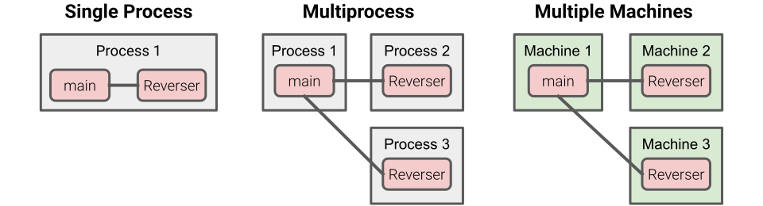
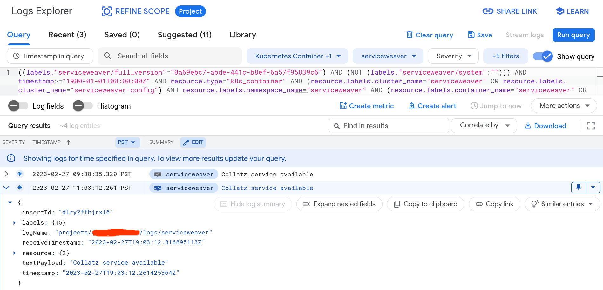
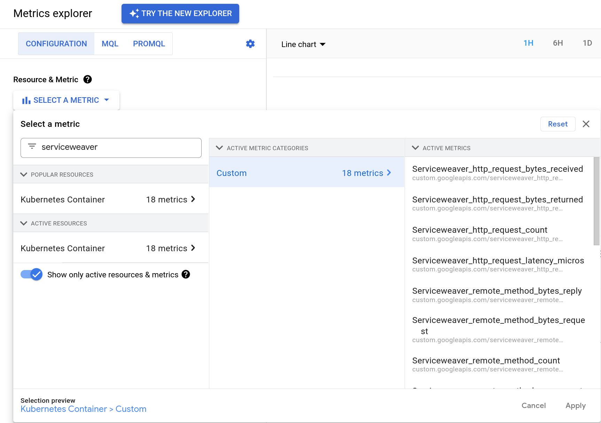
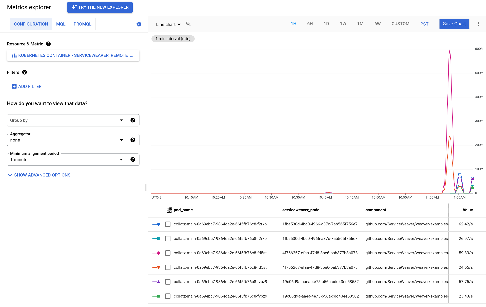

<div hidden class="todo">
TODO: Link to code snippets to make sure they are compilable and runnable.
</div>

# What is Service Weaver?

Service Weaver is a programming framework for writing, deploying, and managing
distributed applications. You can run, test, and debug a Service Weaver application
locally on your machine, and then deploy the application to the cloud with a
single command.

```console
$ go run .                      # Run locally.
$ weaver gke deploy weaver.toml # Run in the cloud.
```

A Service Weaver application is composed of a number **components**. A component is
represented as a regular Go [interface][go_interfaces], and components interact
with each other by calling the methods defined by these interfaces. This makes
writing Service Weaver applications easy. You don't have to write any networking or
serialization code; you just write Go. Service Weaver also provides libraries for
logging, metrics, tracing, routing, testing, and more.

You can deploy a Service Weaver application as easily as running a single command. Under
the covers, Service Weaver will dissect your binary along component boundaries, allowing
different components to run on different machines. Service Weaver will replicate,
autoscale, and co-locate these distributed components for you. It will also
manage all the networking details on your behalf, ensuring that different
components can communicate with each other and that clients can communicate with
your application.

Refer to the [Installation](#installation) section to install Service Weaver on
your machine, or read the [Step by Step Tutorial](#step-by-step-tutorial)
section for a tutorial on how to write Service Weaver applications.

# Installation

Ensure you have [Go installed][go_install], version 1.19 or higher. Then, run
the following to install the `weaver` command:

```console
go install github.com/ServiceWeaver/weaver/cmd/weaver@latest
```

`go install` installs the `weaver` command to `$GOBIN`, which defaults to
`$GOPATH/bin`. Make sure this directory is included in your `PATH`. You can
accomplish this, for example, by adding the following to your `.bashrc` and
running `source ~/.bashrc`:

```console
export PATH="$PATH:$GOPATH/bin"
```

If the installation was successful, you should be able to run `weaver --help`:

```console
$ weaver --help
USAGE

  weaver generate                 // weaver code generator
  weaver single    <command> ...  // for single process deployments
  weaver multi     <command> ...  // for multiprocess deployments
  ...
```

# Step by Step Tutorial

In this section, we show you how to write Service Weaver applications. To follow
along, refer to the [Installation](#installation) section to install Service
Weaver. The full source code presented in this tutorial can be found in [the
examples directory on the project's GitHub page][hello_app].

## Listeners and Servers

We begin with a simple "Hello, World!" HTTP server. Create and `cd` into a
`hello/` directory.  Run `go mod init hello` to create a go module.

```console
mkdir hello/
cd hello/
go mod init hello
```

Create a file called `main.go` with the following contents:

```go
package main

import (
    "context"
    "fmt"
    "log"
    "net/http"

    "github.com/ServiceWeaver/weaver"
)

func main() {
    // Get a network listener on address "localhost:12345".
    root := weaver.Init(context.Background())
    opts := weaver.ListenerOptions{LocalAddress: "localhost:12345"}
    lis, err := root.Listener("hello", opts)
    if err != nil {
        log.Fatal(err)
    }
    fmt.Printf("hello listener available on %v\n", lis)

    // Serve the /hello endpoint.
    http.HandleFunc("/hello", func(w http.ResponseWriter, r *http.Request) {
        fmt.Fprintf(w, "Hello, %s!\n", r.URL.Query().Get("name"))
    })
    http.Serve(lis, nil)
}
```

Here's an explanation of the code:

- `weaver.Init(...)` initializes the Service Weaver application. It also returns
  a `weaver.Instance`, which we assign to `root`. We'll explain instances in
  more detail momentarily.
- `root.Listener(...)` returns a network listener, similar to
  [`net.Listen`][net_listen]. With Service Weaver, listeners are named. In this
  case, we name the listener `"hello"`. A `weaver.ListenerOptions` configures
  the listener. Here, we specify that the listener should listen on address
  `localhost:12345`.
- `http.HandleFunc(...)` registers an HTTP handler for the `/hello?name=<name>`
  endpoint. The handler returns a `Hello, <name>!` greeting.
- `http.Serve(lis, nil)` runs the HTTP server on the provided listener.

Run `go mod tidy` and then `go run .`. The program should print out the name of
the application and a unique deployment id. It should then block serving HTTP
requests on `localhost:12345`.

```console
$ go mod tidy
$ go run .
╭───────────────────────────────────────────────────╮
│ app        : hello                                │
│ deployment : 28807368-1101-41a3-bdcb-9625e0f02ca0 │
╰───────────────────────────────────────────────────╯
hello listener available on 127.0.0.1:12345
...
```

In a separate terminal, curl the server to receive a greeting:

```console
$ curl localhost:12345/hello?name=Weaver
Hello, Weaver!
```

## Components

A Service Weaver application is composed of a number of **components**. A
Service Weaver component is represented with a regular Go
[interface][go_interfaces], and components interact with each other by calling
the methods defined by these interfaces.  In this section, we'll define a simple
`Reverser` component that can reverse strings. Create a file `reverser.go` with
the following contents:

```go
package main

import (
    "context"

    "github.com/ServiceWeaver/weaver"
)

// Reverser component.
type Reverser interface {
    Reverse(context.Context, string) (string, error)
}

// Implementation of the Reverser component.
type reverser struct{
    weaver.Implements[Reverser]
}

func (r *reverser) Reverse(_ context.Context, s string) (string, error) {
    runes := []rune(s)
    n := len(runes)
    for i := 0; i < n/2; i++ {
        runes[i], runes[n-i-1] = runes[n-i-1], runes[i]
    }
    return string(runes), nil
}
```

The `Reverser` component is represented as a `Reverser` interface with,
unsurprisingly, a `Reverse` method that reverses strings. The `reverser` struct
is our implementation of the `Reverser` component (as indicated by the
`weaver.Implements[Reverser]` field it contains). Next, edit the server in
`main.go` to use the `Reverser` component:

```go
func main() {
    // Get a network listener on address "localhost:12345".
    ...
    fmt.Printf("hello listener available on %v\n", lis)

    // Get a client to the Reverser component.
    reverser, err := weaver.Get[Reverser](root)
    if err != nil {
        log.Fatal(err)
    }

    // Serve the /hello endpoint.
    http.HandleFunc("/hello", func(w http.ResponseWriter, r *http.Request) {
        reversed, err := reverser.Reverse(r.Context(), r.URL.Query().Get("name"))
        if err != nil {
            http.Error(w, err.Error(), http.StatusInternalServerError)
        }
        fmt.Fprintf(w, "Hello, %s!\n", reversed)
    })
    http.Serve(lis, nil)
}
```

`weaver.Get[Reverser](root)` returns an instance of the `Reverser` component. We
invoke methods on the component like we would any regular interface. In this
example, we call `reverser.Reverse`.

Before we build and run the server, we need to run Service Weaver's code
generator, called `weaver generate`:

```go
weaver generate .
```

`weaver generate` should create a `weaver_gen.go` file. This file contains code
needed by the Service Weaver runtime. We'll elaborate on what exactly `weaver
generate` does and why we need to run it later. Finally, re-run the server.

```console
$ go run .
╭───────────────────────────────────────────────────╮
│ app        : hello                                │
│ deployment : 5c9753e4-c476-4f93-97a0-0ea599184178 │
╰───────────────────────────────────────────────────╯
hello listener available on 127.0.0.1:12345
...
```

In a separate terminal, curl the server to receive a reversed greeting:

```console
$ curl localhost:12345/hello?name=Weaver
Hello, revaeW!
```

Run `weaver single status` to view the status of the Service Weaver application.
The status shows every deployment, component, and listener.

```console
$ weaver single status
╭────────────────────────────────────────────────────╮
│ DEPLOYMENTS                                        │
├───────┬──────────────────────────────────────┬─────┤
│ APP   │ DEPLOYMENT                           │ AGE │
├───────┼──────────────────────────────────────┼─────┤
│ hello │ 5c9753e4-c476-4f93-97a0-0ea599184178 │ 1s  │
╰───────┴──────────────────────────────────────┴─────╯
╭────────────────────────────────────────────────────╮
│ COMPONENTS                                         │
├───────┬────────────┬────────────────┬──────────────┤
│ APP   │ DEPLOYMENT │ COMPONENT      │ REPLICA PIDS │
├───────┼────────────┼────────────────┼──────────────┤
│ hello │ 5c9753e4   │ main           │ 691625       │
│ hello │ 5c9753e4   │ hello.Reverser │ 691625       │
╰───────┴────────────┴────────────────┴──────────────╯
╭─────────────────────────────────────────────────╮
│ LISTENERS                                       │
├───────┬────────────┬──────────┬─────────────────┤
│ APP   │ DEPLOYMENT │ LISTENER │ ADDRESS         │
├───────┼────────────┼──────────┼─────────────────┤
│ hello │ 5c9753e4   │ hello    │ 127.0.0.1:12345 │
╰───────┴────────────┴──────────┴─────────────────╯
```

You can also run `weaver single dashboard` to open a dashboard in a web browser.

Components are the core abstraction of Service Weaver. All code in a Service
Weaver application runs as part of some component. Even the code inside of the
`main` function runs as part of an implicitly created `main` component (as shown
in the output of `weaver single status`).

The main advantage of components is that they decouple how you *write* your code
from how you *run* your code. They let you write your application as a monolith,
but when you go to run your code, you can run components in a separate process
or on a different machine entirely. Here's a diagram illustrating this concept:



When we `go run` a Service Weaver application, all components run together in a single
process, and method calls between components are executed as regular Go method
calls. We'll now describe how to run each component in a separate process with
method calls between components executed as RPCs.

## Multiprocess Execution

First, create a [TOML](https://toml.io) file named `weaver.toml` with the
following contents:

```toml
[serviceweaver]
binary = "./hello"
```

This config file specifies the binary of the Service Weaver application. Next,
build and run the app using `weaver multi deploy`:

```console
$ go build                        # build the ./hello binary
$ weaver multi deploy weaver.toml # deploy the application
╭───────────────────────────────────────────────────╮
│ app        : hello                                │
│ deployment : 6b285407-423a-46cc-9a18-727b5891fc57 │
╰───────────────────────────────────────────────────╯
S1205 10:21:15.450917 stdout  26b601c4] hello listener available on 127.0.0.1:12345
S1205 10:21:15.454387 stdout  88639bf8] hello listener available on 127.0.0.1:12345
```

Note that `weaver multi` replicates every component twice, which is why you see
two log entries. We elaborate on replication more in the
[Components](#components) section later.

In a separate terminal, curl the server:

```console
$ curl localhost:12345/hello?name=Weaver
Hello, revaeW!
```

When the main component receives your `/hello` HTTP request, it calls the
`reverser.Reverse` method. This method call is executed as an RPC to the
`Reverser` component running in a different process. Remember earlier when we
ran `weaver generate`, the Service Weaver code generator? One thing that `weaver
generate` does is generate RPC clients and servers for every component to make
this communication possible.

Run `weaver multi status` to view the status of the Service Weaver application.
Note that the `main` and `Reverser` components are replicated twice, and every
replica is run in its own OS process.

```console
$ weaver multi status
╭────────────────────────────────────────────────────╮
│ DEPLOYMENTS                                        │
├───────┬──────────────────────────────────────┬─────┤
│ APP   │ DEPLOYMENT                           │ AGE │
├───────┼──────────────────────────────────────┼─────┤
│ hello │ 6b285407-423a-46cc-9a18-727b5891fc57 │ 3s  │
╰───────┴──────────────────────────────────────┴─────╯
╭──────────────────────────────────────────────────────╮
│ COMPONENTS                                           │
├───────┬────────────┬────────────────┬────────────────┤
│ APP   │ DEPLOYMENT │ COMPONENT      │ REPLICA PIDS   │
├───────┼────────────┼────────────────┼────────────────┤
│ hello │ 6b285407   │ main           │ 695110, 695115 │
│ hello │ 6b285407   │ hello.Reverser │ 695136, 695137 │
╰───────┴────────────┴────────────────┴────────────────╯
╭─────────────────────────────────────────────────╮
│ LISTENERS                                       │
├───────┬────────────┬──────────┬─────────────────┤
│ APP   │ DEPLOYMENT │ LISTENER │ ADDRESS         │
├───────┼────────────┼──────────┼─────────────────┤
│ hello │ 6b285407   │ hello    │ 127.0.0.1:12345 │
╰───────┴────────────┴──────────┴─────────────────╯
```

You can also run `weaver multi dashboard` to open a dashboard in a web browser.

## Deploying to the Cloud

The ability to run Service Weaver applications locally &mdash; either in a
single process with `go run` or across multiple processes with `weaver multi
deploy` &mdash; makes it easy to quickly develop, debug, and test your
applications. When your application is ready for production, however, you'll
often want to deploy it to the cloud. Service Weaver makes this easy too.

For example, we can deploy our "Hello, World" application to [Google Kubernetes
Engine][gke], Google Cloud's hosted Kubernetes offering, as easily as running a
single command (see the [GKE](#gke) section for details):

```console
weaver gke deploy weaver.toml
```

When you run this command, Service Weaver will

- wrap your application binary into a container;
- upload the container to the cloud project of your choosing;
- create and provision the appropriate Kubernetes clusters;
- set up all load balancers and networking infrastructure; and
- deploy your application on Kubernetes, with components distributed across
  machines in multiple regions.

Service Weaver also integrates your application with existing cloud tooling.
Logs are uploaded to [Google Cloud Logging][cloud_logging], metrics are uploaded
to [Google Cloud Monitoring][cloud_metrics], traces are uploaded to [Google
Cloud Tracing][cloud_trace], etc.

## Next Steps

- Continue reading to get a better understanding of [components](#components)
  and learn about other fundamental features of Service Weaver like
  [logging](#logging), [metrics](#metrics), [routing](#routing), and so on.
- Dive deeper into the various ways you can deploy a Service Weaver application,
  including [single process](#single-process), [multiprocess](#multiprocess),
  and [GKE](#gke) deployers.
- Read through [example Service Weaver applications][weaver_examples] that
  demonstrate what Service Weaver has to offer.
- Check out [Service Weaver's source code on GitHub][weaver_github].
- Read [our blog](/blog).

<div hidden class="todo">
    TODO(mwhittaker): Link to API docs.
    TODO(mwhittaker): Link to slack.
</div>

# Components

**Components** are Service Weaver's core abstraction. A component is a
long-lived, possibly replicated entity that exposes a set of methods.
Concretely, a component is represented as a Go interface and corresponding
implementation of that interface. Consider the following `Adder` component for
example:

```go
type Adder interface {
    Add(context.Context, int, int) (int, error)
}

type adder struct {
    weaver.Implements[Adder]
}

func (*adder) Add(_ context.Context, x, y int) (int, error) {
    return x + y, nil
}
```

`Adder` defines the component's interface, and `adder` defines the component's
implementation. The two are linked with the embedded `weaver.Implements[Adder]`
field. You can call the `weaver.Get[Adder]` function to get a client to the
`Adder` component. The returned client implements the component's interface, so
you can invoke the component's methods as you would any regular go method. When
you invoke a component's method, the method call is performed by one of the
possibly many component replicas.

Components are generally long-lived, but the Service Weaver runtime may scale up
or scale down the number of replicas of a component over time based on load.
Similarly, component replicas may fail and get restarted. Service Weaver may
also move component replicas around, co-locating two chatty components in the
same OS process, for example, so that communication between the components is
done locally rather than over the network.

## Interfaces

Every method in a component interface must receive a `context.Context` as its
first argument and return an `error` as its final result. All other arguments
must be [serializable](#serializable-types). These are all valid component
methods:

```go
a(context.Context) error
b(context.Context, int) error
c(context.Context) (int, error)
d(context.Context, int) (int, error)
```

These are all *invalid* component methods:

```go
a() error                          // no context.Context argument
b(context.Context)                 // no error result
c(int, context.Context) error      // first argument isn't context.Context
d(context.Context) (error, int)    // final result isn't error
e(context.Context, chan int) error // chan int isn't serializable
```

## Implementation

A component implementation must be a struct that looks like:

```go
type foo struct{
    weaver.Implements[Foo]
    // ...
}
```

-   It must be a struct.
-   It must embed a `weaver.Implements[C]` field where `C` is component
    interface it implements.

`weaver.Implements[T]` implements the `weaver.Instance` interface and therefore
every component implementation (including `foo`) also implements
`weaver.Instance`.

If a component implementation implements an `Init(context.Context) error`
method, it will be called when an instance of the component is created.

```go
func (f *foo) Init(context.Context) error {
    // ...
}
```

## Semantics

When implementing a component, there are three semantic details to keep in mind:

1.  A component's state is not persisted.
2.  A component's methods may be invoked concurrently.
3.  There may be multiple replicas of a component.

Take the following `Cache` component for example, which maintains an in-memory
key-value cache.

```go
type Cache interface {
    Put(ctx context.Context, key, value string) error
    Get(ctx context.Context, key string) (string, error)
}

type cache struct {
    mu sync.Mutex
    data map[string]string
}

func (c *Cache) Put(_ context.Context, key, value string) error {
    c.mu.Lock()
    defer c.mu.Unlock()
    c.data[key] = value
    return nil
}

func (c *Cache) Get(_ context.Context, key string) (string, error) {
    c.mu.Lock()
    defer c.mu.Unlock()
    return c.data[key], nil
}
```

Noting the points above:

1.  A `Cache`'s state is not persisted, so if a `Cache` replica fails, its data
    is lost. Any state that needs to be persisted should be persisted
    explicitly.
2.  A `Cache`'s methods may be invoked concurrently, so it's essential that we
    guard access to `data` with the mutex `mu`.
3.  There may be multiple replicas of a `Cache` component, so it is not
    guaranteed that one client's `Get` will be routed to the same replica as
    another client's `Put`. For this example, this means that the `Cache` has
    [weak consistency][weak_consistency].

Method calls are executed with at-most-once semantics. This means that Service Weaver
does not automatically retry method calls that fail. However, you can detect and
retry failed method calls explicitly using `weaver.ErrRetriable`. If a method
call fails because of a transient system error (e.g., a component replica
crashed, the network is partitioned), it returns an error with an embedded
`weaver.ErrRetriable`. This allows you to retry failed method calls like this:

```go
// Retry the cache.Get method call up to five times.
var val string
var err error
for i := 0; i < 5; i++ {
    val, err = cache.Get(ctx, "key")
    if errors.Is(err, weaver.ErrRetriable) {
        // Retriable system error! Retry.
        continue
    }
    break
}
```

## Lifetime

The `weaver.Get` function returns a client to a component; `weaver.Get[Foo]`
returns a client to the `Foo` component, for example. Components are constructed
the first time you call `weaver.Get`. Constructing a component can sometimes be
expensive. When deploying a Service Weaver application on the cloud, for example,
constructing a component may involve launching a container. For this reason, we
recommend you call `weaver.Get` proactively to incur this overhead at
initialization time rather than on the critical path of serving a client
request.

## Config

Service Weaver uses [config files](#config-files), written in [TOML](#toml), to
configure how applications are run. A minimal config file, for example, simply
lists the application binary:

```toml
[serviceweaver]
binary = "./hello"
```

A config file may additionally contain component-specific configuration
sections, which allow you to configure the components in your application. For
example, consider the following `Greeter` component.

```go
type Greeter interface {
    Greet(context.Context, string) (string, error)
}

type greeter struct {
    weaver.Implements[Greeter]
}

func (g *greeter) Greet(_ context.Context, name string) (string, error) {
    return fmt.Sprintf("Hello, %s!", name), nil
}
```

Rather than hard-coding the greeting `"Hello"`, we can provide a greeting in a
config file. First, we define a options struct.

```go
type greeterOptions struct {
    Greeting string
}
```

Next, we associate the options struct with the `greeter` implementation by
embedding the `weaver.WithConfig[T]` struct.

```go
type greeter struct {
    weaver.Implements[Greeter]
    weaver.WithConfig[greeterOptions]
}
```

Now, we can add a `Greeter` section to the config file. The section is keyed by
the full path-prefixed name of the component.

```toml
["example.com/mypkg/Greeter"]
Greeting = "Bonjour"
```

When the `Greeter` component is created, Service Weaver will automatically parse
the `Greeter` section of the config file into a `greeterOptions` struct. You can
access the populated struct via the `Config` method of the embedded `WithConfig`
struct. For example:

```go
func (g *greeter) Greet(_ context.Context, name string) (string, error) {
    greeting := g.Config().Greeting
    if greeting == "" {
        greeting = "Hello"
    }
    return fmt.Sprintf("%s, %s!", greeting, name), nil
}
```

<div hidden class="todo">
    Move the next part to the Single Process section and forward link.
</div>

If you run an application directly (i.e. using `go run`), you can pass the
config file using the `SERVICEWEAVER_CONFIG` environment variable:

```console
SERVICEWEAVER_CONFIG=weaver.toml go run .
```

# Logging

<div hidden class="todo">
TODO(mwhittaker): Pick a better name for node ids?
</div>

Service Weaver provides a logging API, `weaver.Logger`. By using Service
Weaver's logging API, you can cat, tail, search, and filter logs from every one
of your Service Weaver applications (past or present). Service Weaver also
integrates the logs into the environment where your application is deployed. If
you [deploy a Service Weaver application to Google Cloud](#gke), for example,
logs are automatically exported to [Google Cloud Logging][cloud_logging].

Use the `Logger` method of a component implementation to get a logger scoped to
the component. For example:

```go
type Adder interface {
    Add(context.Context, int, int) (int, error)
}

type adder struct {
    weaver.Implements[Adder]
}

func (a *adder) Add(_ context.Context, x, y int) (int, error) {
    // adder embeds weaver.Implements[Adder] which provides the Logger method.
    logger := a.Logger()
    logger.Debug("A debug log.")
    logger.Info("An info log.")
    logger.Error("An error log.", fmt.Errorf("an error"))
    return x + y, nil
}
```

Logs look like this:

```console
D1103 08:55:15.650138 main.Adder 73ddcd04 adder.go:12] A debug log.
I1103 08:55:15.650149 main.Adder 73ddcd04 adder.go:13] An info log.
E1103 08:55:15.650158 main.Adder 73ddcd04 adder.go:14] An error log. err="an error"
```

The first character of a log line indicates whether the log is a [D]ebug,
[I]nfo, or [E]rror log entry. Then comes the date in `MMDD` format, followed by
the time. Then comes the component name followed by a logical node id. If two
components are co-located in the same OS process, they are given the same node
id. Then comes the file and line where the log was produced, followed finally by
the contents of the log.

The main component returned by `weaver.Init` has a Logger method as well (like
all `weaver.Instance`s):

```go
func main() {
    root := weaver.Init(context.Background())
    root.Logger().Info("Hello, World!")
    ...
}
```

Service Weaver also allows you to attach key-value attributes to log entries.
These attributes can be useful when searching and filtering logs.

```go
logger.Info("A log with attributes.", "foo", "bar")  // adds foo="bar"
```

If you find yourself adding the same set of key-value attributes repeatedly, you
can pre-create a logger that will add those attributes to all log entries:

```go
fooLogger = logger.With("foo", "bar")
fooLogger.Info("A log with attributes.")  // adds foo="bar"
```

Note that you can also add normal print statements to your code. These prints
will be captured and logged by Service Weaver, but they won't be associated with
a particular component, they won't have `file:line` information, and they won't
have any attributes, so we recommend you use a `weaver.Logger` whenever
possible.

```console
S1027 14:40:55.210541 stdout d772dcad] This was printed by fmt.Println
```

Refer to the deployer-specific documentation to learn how to search and filter
logs for [single process](#single-process-logging),
[multiprocess](#multiprocess-logging), and [GKE](#gke-logging) deployments.

# Metrics

Service Weaver provides an API for [metrics][metric_types]; specifically
[counters][prometheus_counter], [gauges][prometheus_gauge], and
[histograms][prometheus_histogram].

- A **counter** is a number that can only increase over time. It never
  decreases. You can use a counter to measure things like the number of HTTP
  requests your program has processed so far.
- A **gauge** is a number that can increase *or* decrease over time. You can use
  a gauge to measure things like the current amount of memory your program is
  using, in bytes.
- A **histogram** is a collection of numbers that are grouped into buckets. You
  can use a histogram to measure things like the latency of every HTTP request
  your program has received so far.

Service Weaver integrates these metrics into the environment where your application is
deployed. If you [deploy a Service Weaver application to Google Cloud](#gke), for
example, metrics are automatically exported to the [Google Cloud Metrics
Explorer][metrics_explorer] where they can be queried, aggregated, and graphed.

Here's an example of how to add metrics to a simple `Adder` component.

```go
var (
    addCount = weaver.NewCounter(
        "add_count",
        "The number of times Adder.Add has been called",
    )
    addConcurrent = weaver.NewGauge(
        "add_concurrent",
        "The number of concurrent Adder.Add calls",
    )
    addSum = weaver.NewHistogram(
        "add_sum",
        "The sums returned by Adder.Add",
        []float64{1, 10, 100, 1000, 10000},
    )
)

type Adder interface {
    Add(context.Context, int, int) (int, error)
}

type adder struct {
    weaver.Implements[Adder]
}

func (*adder) Add(_ context.Context, x, y int) (int, error) {
    addCount.Add(1.0)
    addConcurrent.Add(1.0)
    defer addConcurrent.Sub(1.0)
    addSum.Put(float64(x + y))
    return x + y, nil
}
```

Refer to the deployer-specific documentation to learn how to view metrics for
[single process](#single-process-metrics), [multiprocess](#multiprocess-metrics),
and [GKE](#gke-metrics) deployments.

## Labels

Metrics can also have a set of key-value labels. Service Weaver represents
labels using structs. Here's an example of how to declare and use a labeled
counter to count the parity of the argument to a `Halve` method.

```go
type halveLabels struct {
    Parity string // "odd" or "even"
}

var (
    halveCounts = weaver.NewCounterMap[halveLabels](
        "halve_count",
        "The number of values that have been halved",
    )
    oddCount = halveCounts.Get(halveLabels{"odd"})
    evenCount = halveCounts.Get(halveLabels{"even"})
)

type Halver interface {
    Halve(context.Context, int) (int, error)
}

type halver struct {
    weaver.Implements[Halver]
}

func (halver) Halve(_ context.Context, val int) (int, error) {
    if val % 2 == 0 {
        evenCount.Add(1)
    } else {
        oddCount.Add(1)
    }
    return val / 2, nil
}
```

To adhere to [popular metric naming conventions][prometheus_naming], Service
Weaver lowercases the first letter of every label by default. The `Parity` field
for example is exported as `parity`. You can override this behavior and provide
a custom label name using a `weaver` annotation.

```go
type labels struct {
    Foo string                           // exported as "foo"
    Bar string `weaver:"my_custom_name"` // exported as "my_custom_name"
}
```

## Auto-Generated Metrics

Service Weaver automatically creates and maintains the following set of metrics, which
measure the count, latency, and chattiness of every remote component method
invocation. Every metric is labeled by the calling component as well as the
invoked component and method.

-   `serviceweaver_remote_method_count`: Count of Service Weaver component
    method invocations.
-   `serviceweaver_remote_method_error_count`: Count of Service Weaver component
    method invocations that result in an error.
-   `serviceweaver_remote_method_latency_micros`: Duration, in microseconds, of
    Service Weaver component method execution.
-   `serviceweaver_remote_method_bytes_request`: Number of bytes in Service
    Weaver component method requests.
-   `serviceweaver_remote_method_bytes_reply`: Number of bytes in Service Weaver
    component method replies.

Note that these metrics only measure *remote* method calls. Local method calls,
like those between two co-located components, are not measured.

## HTTP Metrics

Service Weaver declares the following set of HTTP related metrics.

-   `serviceweaver_http_request_count`: Count of HTTP requests.
-   `serviceweaver_http_error_count`: Count of HTTP requests resulting in a 4XX or 5XX
    response. This metric is also labeled with the returned status code.
-   `serviceweaver_http_request_latency_micros`: Duration, in microseconds, of HTTP
    request execution.
-   `serviceweaver_http_request_bytes_received`: Estimated number of bytes *received* by
    an HTTP handler.
-   `serviceweaver_http_request_bytes_returned`: Estimated number of bytes *returned* by
    an HTTP handler.

If you pass an [`http.Handler`](https://pkg.go.dev/net/http#Handler) to the
`weaver.InstrumentHandler` function, it will return a new `http.Handler` that
updates these metrics automatically, labeled with the provided label. For
example:

```go
// Metrics are recorded for fooHandler with label "foo".
var mux http.ServeMux
var fooHandler http.Handler = ...
mux.Handle("/foo", weaver.InstrumentHandler("foo", fooHandler))
```

# Tracing

Service Weaver relies on [OpenTelemetry][otel] to trace your application.
Service Weaver exports these traces into the environment where your application
is deployed. If you [deploy a Service Weaver application to Google Cloud](#gke),
for example, traces are automatically exported to [Google Cloud
Trace][cloud_trace]. Here's an example of how to enable tracing for a simple
`Hello, World!` application.

```go
import (
    "context"
    "fmt"
    "log"
    "net/http"

    "go.opentelemetry.io/contrib/instrumentation/net/http/otelhttp"
    "github.com/ServiceWeaver/weaver"
)

func main() {
    // Get a network listener on address "localhost:12345".
    root := weaver.Init(context.Background())
    opts := weaver.ListenerOptions{LocalAddress: "localhost:12345"}
    lis, err := root.Listener("hello", opts)
    if err != nil {
        log.Fatal(err)
    }
    fmt.Printf("hello listener available on %v\n", lis)

    // Serve the /hello endpoint.
    http.HandleFunc("/hello", func(w http.ResponseWriter, r *http.Request) {
        fmt.Fprintf(w, "Hello, %s!\n", r.URL.Query().Get("name"))
    })

    // Create an otel handler to enable tracing.
    otelHandler := otelhttp.NewHandler(http.DefaultServeMux, "http")
    http.Serve(lis, otelHandler)
}
```

This code does the following:

- `http.HandleFunc("/hello", ...)` registers a handler with the default HTTP
  mux, called `http.DefaultServeMux`.
- `otelhttp.NewHandler(http.DefaultServeMux, "http")` returns a new HTTP handler
  that wraps the default HTTP mux.
- `http.Serve(lis, otelHandler)` serves HTTP traffic on `lis` using the
  OpenTelemetry handler.

Using the OpenTelemetry HTTP handler enables tracing. Once tracing is enabled,
all HTTP requests and resulting component method calls will be automatically
traced. Service Weaver will collect and export the traces for you. Refer to the
deployer-specific documentation for [single process](#single-process-tracing),
[multiprocess](#multiprocess-tracing), and [GKE](#gke-tracing) to learn about
deployer specific exporters.

The step above is all you need to get started with tracing. If you want to add
more application-specific details to your traces, you can add attributes,
events, and errors using the context passed to registered HTTP handlers and
component methods. For example, in our `hello` example, you can add an event as
follows:

```go
http.HandleFunc("/hello", func(w http.ResponseWriter, r *http.Request) {
    fmt.Fprintf(w, "Hello, %s!\n", r.URL.Query().Get("name"))
    trace.SpanFromContext(r.Context()).AddEvent("writing response",
        trace.WithAttributes(
            label.String("content", "hello "),
            label.String("answer", r.URL.Query().Get("name")),
        ))
})
```

Refer to [OpenTelemetry Go: All you need to know][otel_all_you_need] to learn
more about how to add more application-specific details to your traces.

# Profiling

Service Weaver allows you to profile an entire Service Weaver application, even one that is
deployed in multiple processes across multiple machines. Service Weaver profiles every
individual binary and aggregates them into a single profile that captures the
performance of the application as a whole. Refer to the deployer-specific
documentation for details on how to collect profiles for [single
process](#single-process-profiling), [multiprocess](#multiprocess-profiling),
and [GKE](#gke-profiling) deployments.

# Routing

By default, when a client invokes a remote component's method, this method call
will be performed by one of possibly many component replicas, selected
arbitrarily. It is sometimes beneficial for method invocations to be routed to
*a particular* replica based on the arguments provided to the method. For
example, consider a `Cache` component that maintains an in-memory cache in front
of an underlying disk-backed key-value store:

```go
type Cache interface {
    Get(ctx context.Context, key string) (string, error)
    Put(ctx context.Context, key, value string) error
}

type cache struct {
    weaver.Implements[Cache]
    // ...
}
```

To increase the cache hit ratio, we may want to route every request for a given
key to the same replica. Service Weaver supports this affinity based routing by allowing
the application to specify a router type associated with the component
implementation. For example:

```go
type cacheRouter struct{}
func (cacheRouter) Get(_ context.Context, key string) string { return key }
func (cacheRouter) Put(_ context.Context, key, value string) string { return key }
```

For every component method that needs to be routed (e.g., `Get` and `Put`), the
router type should implement an equivalent method (i.e., same name and
argument types) whose return type is the routing key. When a component's routed
method is invoked, its corresponding router method is invoked to produce a
routing key. Method invocations that produce the same key are routed to the same
replica.

A routing key can be

-   any integer (e.g., `int`, `int32`), float (i.e. `float32`, `float64`), or
    string; or
-   a struct where every field is an integer, float, or string (e.g., `struct{x
    int; y string}`).

Every router method must return the same routing key type. The following, for
example, is invalid:

```go
// ERROR: Get returns a string, but Put returns an int.
func (cacheRouter) Get(_ context.Context, key string) string { return key }
func (cacheRouter) Put(_ context.Context, key, value string) int { return 42 }
```

To associate a router with its component, embed a `weaver.WithRouter[T]` field in
the component implementation where `T` is the type of the router.

```go
type cache struct {
    weaver.Implements[Cache]
    weaver.WithRouter[cacheRouter]
    // ...
}
```

**NOTE** that routing is done on a best-effort basis. Service Weaver will try to route
method invocations with the same key to the same replica, but this is *not*
guaranteed. As a corollary, you should *never* depend on routing for
correctness. Only use routing to increase performance in the common case.

Also note that if a component invokes a method on a co-located component, the
method call will always be executed by the co-located component and won't be
routed.

# Storage

We expect most Service Weaver applications to persist their data in some way. For
example, an e-commerce application may store its products catalog and user
information in a database and access them while serving user requests.

By default, Service Weaver leaves the storage and retrieval of application data
up to the developer. If you're using a database, for example, you have to create
the database, pre-populate it with data, and write the code to access the
database from your Service Weaver application.

Below is an example of how database information can be passed to a simple
`Adder` component using a [config file](#components-config). First, the config
file:

```toml
["example.com/mypkg/Adder"]
Driver = "mysql"
Source = "root:@tcp(localhost:3306)/"
```

And the application that uses it:

```go
type Adder interface {
    Add(context.Context, int, int) (int, error)
}

type adder struct {
    weaver.Implements[Adder]
    weaver.WithConfig[config]

    db *sql.DB
}

type config struct {
    Driver string // Name of the DB driver.
    Source string // DB data source.
}

func (a *adder) Init(_ context.Context) error {
    db, err := sql.Open(a.Config().Driver, a.Config().Source)
    r.db = db
    return err
}

func (a *Adder) Add(ctx context.Context, x, y int) (int, error) {
    // Check in the database first.
    var sum int
    const q = "SELECT sum FROM table WHERE x=? AND y=?;"
    if err := r.db.QueryRowContext(ctx, q, x, y).Scan(&sum); err == nil {
        return sum, nil
    }

    // Make a best-effort attempt to store in the database.
    q = "INSERT INTO table(x, y, sum) VALUES (?, ?, ?);"
    r.db.ExecContext(ctx, q, x, y, x + y)
    return x + y, nil
}
```

A similar process can be followed to pass database information using Go flags or
environment variables.

# Testing

Service Weaver includes a `weavertest` package that you can use to test your
Service Weaver applications. Use `weavertest.Init` as a drop-in replacement for
`weaver.Init`. To test an `Adder` component  with an `Add` method, for example,
create an `adder_test.go` file with the following contents.

```go
package main

import (
    "context"
    "testing"

    "github.com/ServiceWeaver/weaver"
    "github.com/ServiceWeaver/weaver/weavertest"
)

func TestAdd(t *testing.T) {
    ctx := context.Background()
    root := weavertest.Init(ctx, t, weavertest.Options{})
    adder, err := weaver.Get[Adder](root)
    if err != nil {
        t.Fatal(err)
    }
    got, err := adder.Add(ctx, 1, 2)
    if err != nil {
        t.Fatal(err)
    }
    if want := 3; got != want {
        t.Fatalf("got %q, want %q", got, want)
    }
}
```

Run `go test` to run the test. `weavertest.Init` receives a `weavertest.Options`,
which you can use to configure the execution of the test. By default,
`weavertest.Init` will run every component in a different process. This is
similar to what happens when you run `weaver multi deploy`. If you set the
`SingleProcess` option, `weavertest.Init` will instead run every component in a
single process, similar to what happens when you `go run` a Service Weaver application.
You can test in both single and multiprocess mode to ensure that your components
work whether they are co-located in the same process or distributed across
multiple processes.

```go
func TestAdd(t *testing.T) {
    for _, single := range []bool{true, false} {
        t.Run(fmt.Sprintf("Single=%t", single), func(t *testing.T) {
            opts := weavertest.Options{SingleProcess: single}
            root := weavertest.Init(context.Background(), t, opts)
            adder, err := weaver.Get[Adder](root)
            // ...
        })
    }
}
```

You can also provide the contents of a [config file](#config-files) using the
`Config` field of the `weavertest.Options` struct.

<div hidden class="todo">
TODO(mwhittaker): Explain how you can unit test a component directly, but it's
not as recommended.
</div>

# Versioning

Serving systems evolve over time. Whether you're fixing bugs or adding new
features, it is inevitable that you will have to roll out a new version of your
system to replace the currently running version. To maintain the availability of
their systems, people typically perform **rolling updates**, where the nodes in
a deployment are updated from the old version to the new version one by one.

During a rolling update, nodes running the old version of the code will have to
communicate with other nodes running the new version of the code. Ensuring that
a system is correct despite the possibility of these cross-version interactions
is very challenging. In
[*Understanding and Detecting Software Upgrade Failures in Distributed Systems*][update_failures_paper],
Zhang et al. perform a case study of 123 failed updates in 8 widely used
systems. They found that the majority of failures were caused by the
interactions between multiple versions of a system:

>    _About two thirds of update failures are caused by interaction between two
>    software versions that hold incompatible data syntax or semantics
>    assumption._


Service Weaver takes a different approach to rollouts and sidesteps these
complex cross-version interactions. Service Weaver ensures that client requests
are executed entirely within a single version of a system. A component in one
version will *never* communicate with a component in a different version. This
eliminates the leading cause of update failures, allowing you to roll out new
versions of your Service Weaver application safely and with less headache.

Avoiding cross-version communication is trivial for applications deployed using
[`go run`](#single-process) or [`weaver multi deploy`](#multiprocess) because
every deployment runs independently from one another. Refer to the
[GKE Deployments](#gke-multi-region) and
[GKE Versioning](#gke-versioning) sections to learn how Service Weaver uses a combination
of [blue/green deployments][blue_green] and autoscaling to slowly shift traffic
from an old version of a Service Weaver application running on GKE to a new version,
avoiding cross-version communication in a resource-efficient manner.

# Single Process

## Getting Started

The simplest and easiest way to deploy a Service Weaver application is to run it
directly via `go run`. When you `go run` a Service Weaver application, every
component is co-located in a single process, and method calls between components
are executed as regular Go method calls. Refer to the [Step by Step
Tutorial](#step-by-step-tutorial) section for a full example.

```console
go run .
```

You can run `weaver single status` to view the status of all active Service
Weaver applications deployed using `go run`.

```console
$ weaver single status
╭────────────────────────────────────────────────────╮
│ DEPLOYMENTS                                        │
├───────┬──────────────────────────────────────┬─────┤
│ APP   │ DEPLOYMENT                           │ AGE │
├───────┼──────────────────────────────────────┼─────┤
│ hello │ a4bba25b-6312-4af1-beec-447c33b8e805 │ 26s │
│ hello │ a4d4c71b-a99f-4ade-9586-640bd289158f │ 19s │
│ hello │ bc663a25-c70e-440d-b022-04a83708c616 │ 12s │
╰───────┴──────────────────────────────────────┴─────╯
╭─────────────────────────────────────────────────────╮
│ COMPONENTS                                          │
├───────┬────────────┬─────────────────┬──────────────┤
│ APP   │ DEPLOYMENT │ COMPONENT       │ REPLICA PIDS │
├───────┼────────────┼─────────────────┼──────────────┤
│ hello │ a4bba25b   │ main            │ 123450       │
│ hello │ a4bba25b   │ hello.Reverser  │ 123450       │
│ hello │ a4d4c71b   │ main            │ 903510       │
│ hello │ a4d4c71b   │ hello.Reverser  │ 903510       │
│ hello │ bc663a25   │ main            │ 489102       │
│ hello │ bc663a25   │ hello.Reverser  │ 489102       │
╰───────┴────────────┴─────────────────┴──────────────╯
╭────────────────────────────────────────────╮
│ LISTENERS                                  │
├───────┬────────────┬──────────┬────────────┤
│ APP   │ DEPLOYMENT │ LISTENER │ ADDRESS    │
├───────┼────────────┼──────────┼────────────┤
│ hello │ a4bba25b   │ hello    │ [::]:33541 │
│ hello │ a4d4c71b   │ hello    │ [::]:41619 │
│ hello │ bc663a25   │ hello    │ [::]:33319 │
╰───────┴────────────┴──────────┴────────────╯
```

You can also run `weaver single dashboard` to open a dashboard in a web browser.

## Listeners

You can call the `Listener` method on a `weaver.Instance` to get a network
listener (see the [Step by Step Tutorial](#step-by-step-tutorial) section for
context).

```go
opts := weaver.ListenerOptions{LocalAddress: "localhost:12345"}
lis, err := root.Listener("hello", opts)
```

When you deploy an application using `go run`, the `Listener` method returns a
listener on the address specified by the `LocalAddress` field of the
`ListenerOptions` struct. In this way, the `Listener` method behaves pretty much
identically to the built-in [`net.Listen`](https://pkg.go.dev/net#Listen).

## Logging

When you deploy a Service Weaver application with `go run`, [logs](#logging) are
printed to standard out. These logs are not persisted. You can optionally save
the logs for later analysis using basic shell constructs:

```console
go run . | tee mylogs.txt
```

## Metrics

Run `weaver single dashboard` to open a dashboard in a web browser. The
dashboard has a page for every Service Weaver application deployed via `go run
.`.  Every deployment's page has a link to the deployment's [metrics](#metrics).
The metrics are exported in [Prometheus format][prometheus] and looks something
like this:

```txt
# Metrics in Prometheus text format [1].
#
# To visualize and query the metrics, make sure Prometheus is installed on
# your local machine and then add the following stanza to your Prometheus yaml
# config file:
#
# scrape_configs:
# - job_name: 'prometheus-serviceweaver-scraper'
#   scrape_interval: 5s
#   metrics_path: /debug/serviceweaver/prometheus
#   static_configs:
#     - targets: ['127.0.0.1:43087']
#
# [1]: https://prometheus.io

# HELP example_count An example counter.
# TYPE example_count counter
example_count{serviceweaver_node="bbc9beb5"} 42
example_count{serviceweaver_node="00555c38"} 9001

# ┌─────────────────────────────────────┐
# │ SERVICEWEAVER AUTOGENERATED METRICS │
# └─────────────────────────────────────┘
# HELP serviceweaver_method_count Count of Service Weaver component method invocations
# TYPE serviceweaver_method_count counter
serviceweaver_method_count{caller="main",component="main.Example",serviceweaver_node="9fa07495",method="Foo"} 0
serviceweaver_method_count{caller="main",component="main.Example",serviceweaver_node="ee76816d",method="Foo"} 1
...
```

As the header explains, you can visualize and query the metrics by installing
Prometheus and configuring it, using the provided stanza, to periodically scrape
the `/debug/serviceweaver/prometheus` endpoint of the provided target
(`127.0.0.1:43087` in the example above). You can also inspect the metrics
manually. The metrics page shows the latest value of every metric in your
application followed by [the metrics that Service Weaver automatically creates
for you](#metrics-auto-generated-metrics).

## Profiling

Use the `weaver single profile` command to collect a profile of your Service Weaver
application. Invoke the command with the id of your deployment. For example,
imagine you `go run` your Service Weaver application and it gets a deployment id
`28807368-1101-41a3-bdcb-9625e0f02ca0`.

```console
$ go run .
╭───────────────────────────────────────────────────╮
│ app        : hello                                │
│ deployment : 28807368-1101-41a3-bdcb-9625e0f02ca0 │
╰───────────────────────────────────────────────────╯
```

In a separate terminal, you can run the `weaver single profile` command.

```console
$ weaver single profile 28807368               # Collect a CPU profile.
$ weaver single profile --duration=1m 28807368 # Adjust the duration of the profile.
$ weaver single profile --type=heap 28807368   # Collect a heap profile.
```

`weaver single profile` prints out the filename of the collected profile. You can
use the `go tool pprof` command to visualize and analyze the profile. For
example:

```console
$ profile=$(weaver single profile <deployment>) # Collect the profile.
$ go tool pprof -http=localhost:9000 $profile   # Visualize the profile.
```

Refer to `weaver single profile --help` for more details. Refer to `go tool pprof
--help` for more information on how to use pprof to analyze your profiles. Refer
to [*Profiling Go Programs*][pprof_blog] for a tutorial.

## Tracing

Run `weaver single dashboard` to open a dashboard in a web browser. The
dashboard has a page for every Service Weaver application deployed via `go run
.`.  Every deployment's page has a link to the deployment's [traces](#tracing)
accessible via [Perfetto][perfetto]. Here's an example of what the tracing page
looks like:


Refer to [Perfetto UI Docs](https://perfetto.dev/docs/visualization/perfetto-ui)
to learn more about how to use the tracing UI.

# Multiprocess

## Getting Started

You can use `weaver multi` to deploy a Service Weaver application across
multiple processes on your local machine, with each component replica running in
a separate OS process. Create [a config file](#config-files), say `weaver.toml`,
that points to your compiled Service Weaver application.

```toml
[serviceweaver]
binary = "./your_compiled_serviceweaver_binary"
```

Deploy the application using `weaver multi deploy`:

```console
weaver multi deploy weaver.toml
```

Refer to the [Step by Step Tutorial](#step-by-step-tutorial) section for a full
example.

When `weaver multi deploy` terminates (e.g., when you press `ctrl+c`), the
application is destroyed and all processes are terminated.

You can run `weaver multi status` to view the status of all active Service Weaver
applications deployed using `weaver multi`.

```console
$ weaver multi status
╭────────────────────────────────────────────────────╮
│ DEPLOYMENTS                                        │
├───────┬──────────────────────────────────────┬─────┤
│ APP   │ DEPLOYMENT                           │ AGE │
├───────┼──────────────────────────────────────┼─────┤
│ hello │ a4bba25b-6312-4af1-beec-447c33b8e805 │ 26s │
│ hello │ a4d4c71b-a99f-4ade-9586-640bd289158f │ 19s │
│ hello │ bc663a25-c70e-440d-b022-04a83708c616 │ 12s │
╰───────┴──────────────────────────────────────┴─────╯
╭───────────────────────────────────────────────────────╮
│ COMPONENTS                                            │
├───────┬────────────┬─────────────────┬────────────────┤
│ APP   │ DEPLOYMENT │ COMPONENT       │ REPLICA PIDS   │
├───────┼────────────┼─────────────────┼────────────────┤
│ hello │ a4bba25b   │ main            │ 695110, 695115 │
│ hello │ a4bba25b   │ hello.Reverser  │ 193720, 398751 │
│ hello │ a4d4c71b   │ main            │ 847020, 292745 │
│ hello │ a4d4c71b   │ hello.Reverser  │ 849035, 897452 │
│ hello │ bc663a25   │ main            │ 245702, 157455 │
│ hello │ bc663a25   │ hello.Reverser  │ 997520, 225023 │
╰───────┴────────────┴─────────────────┴────────────────╯
╭────────────────────────────────────────────╮
│ LISTENERS                                  │
├───────┬────────────┬──────────┬────────────┤
│ APP   │ DEPLOYMENT │ LISTENER │ ADDRESS    │
├───────┼────────────┼──────────┼────────────┤
│ hello │ a4bba25b   │ hello    │ [::]:33541 │
│ hello │ a4d4c71b   │ hello    │ [::]:41619 │
│ hello │ bc663a25   │ hello    │ [::]:33319 │
╰───────┴────────────┴──────────┴────────────╯
```

You can also run `weaver multi dashboard` to open a dashboard in a web browser.

## Listeners

You can call the `Listener` method on a `weaver.Instance` to get a network
listener (see the [Step by Step Tutorial](#step-by-step-tutorial) section for
context).

```go
opts := weaver.ListenerOptions{LocalAddress: "localhost:12345"}
lis, err := root.Listener("hello", opts)
```

When you deploy an application using `weaver multi deploy`, the `Listener`
method does two things.

1. It returns a network listener listening on localhost on a random port chosen
   by the operating system (i.e. listening on `localhost:0`).
2. It ensures that an HTTP proxy is running on the address specified by the
   `LocalAddress` field of the `ListenerOptions` struct. This proxy forwards
   traffic to the listener returned by `Listener`. In fact, the proxy balances
   traffic across every replica of the listener. (Recall that components may be
   replicated, and `Listener` is called once per replica.)

## Logging

`weaver multi deploy` logs to stdout. It additionally persists all log entries in
a set of files in `/tmp/serviceweaver/logs/weaver-multi`. Every file contains a stream of
log entries encoded as protocol buffers. You can cat, follow, and filter these
logs using `weaver multi logs`. For example:

```shell
# Display all of the application logs
weaver multi logs

# Follow all of the logs (similar to tail -f).
weaver multi logs --follow

# Display all of the logs for the "todo" app.
weaver multi logs 'app == "todo"'

# Display all of the debug logs for the "todo" app.
weaver multi logs 'app=="todo" && severity=="debug"'

# Display all of the logs for the "todo" app in files called foo.go.
weaver multi logs 'app=="todo" && file.matches("/foo.go$")'

# Display all of the logs that contain the string "error".
weaver multi logs 'payload.contains("error")'

# Display all of the logs that match a regex.
weaver multi logs 'payload.matches("error: file .* already closed")'

# Display all of the logs that have a label "foo" with value "bar".
weaver multi logs 'labels["foo"] == "bar"'

# Display all of the logs in JSON format. This is useful if you want to
# perform some sort of post-processing on the logs.
weaver multi logs --format=json

# Display all of the logs, including internal system logs that are hidden by
# default.
weaver multi logs --system
```

Refer to `weaver multi logs --help` for a full explanation of the query language,
along with many more examples.

## Metrics

Run `weaver multi dashboard` to open a dashboard in a web browser. The dashboard
has a page for every Service Weaver application deployed via `weaver muli
deploy`.  Every deployment's page has a link to the deployment's
[metrics](#metrics). The metrics are exported in [Prometheus
format][prometheus] and looks something like this:

```txt
# Metrics in Prometheus text format [1].
#
# To visualize and query the metrics, make sure Prometheus is installed on
# your local machine and then add the following stanza to your Prometheus yaml
# config file:
#
# scrape_configs:
# - job_name: 'prometheus-serviceweaver-scraper'
#   scrape_interval: 5s
#   metrics_path: /debug/serviceweaver/prometheus
#   static_configs:
#     - targets: ['127.0.0.1:43087']
#
#
# [1]: https://prometheus.io

# HELP example_count An example counter.
# TYPE example_count counter
example_count{serviceweaver_node="bbc9beb5"} 42
example_count{serviceweaver_node="00555c38"} 9001

# ┌─────────────────────────────────────┐
# │ SERVICEWEAVER AUTOGENERATED METRICS │
# └─────────────────────────────────────┘
# HELP serviceweaver_method_count Count of Service Weaver component method invocations
# TYPE serviceweaver_method_count counter
serviceweaver_method_count{caller="main",component="main.Example",serviceweaver_node="9fa07495",method="Foo"} 0
serviceweaver_method_count{caller="main",component="main.Example",serviceweaver_node="ee76816d",method="Foo"} 1
...
```

As the header explains, you can visualize and query the metrics by installing
Prometheus and configuring it, using the provided stanza, to periodically scrape
the `/debug/serviceweaver/prometheus` endpoint of the provided target (e.g.,
`127.0.0.1:43087`). You can also inspect the metrics manually. The metrics page
shows the latest value of every metric in your application followed by [the
metrics that Service Weaver automatically creates for
you](#metrics-auto-generated-metrics).

## Profiling

Use the `weaver multi profile` command to collect a profile of your Service Weaver
application. Invoke the command with the id of your deployment. For example,
imagine you `weaver multi deploy` your Service Weaver application and it gets a deployment
id `28807368-1101-41a3-bdcb-9625e0f02ca0`.

```console
$ weaver multi deploy weaver.toml
╭───────────────────────────────────────────────────╮
│ app        : hello                                │
│ deployment : 28807368-1101-41a3-bdcb-9625e0f02ca0 │
╰───────────────────────────────────────────────────╯
```

In a separate terminal, you can run the `weaver multi profile` command.

```console
$ weaver multi profile 28807368               # Collect a CPU profile.
$ weaver multi profile --duration=1m 28807368 # Adjust the duration of the profile.
$ weaver multi profile --type=heap 28807368   # Collect a heap profile.
```

`weaver multi profile` prints out the filename of the collected profile. You can
use the `go tool pprof` command to visualize and analyze the profile. For
example:

```console
$ profile=$(weaver multi profile <deployment>) # Collect the profile.
$ go tool pprof -http=localhost:9000 $profile # Visualize the profile.
```

Refer to `weaver multi profile --help` for more details. Refer to `go tool pprof
--help` for more information on how to use pprof to analyze your profiles. Refer
to [*Profiling Go Programs*][pprof_blog] for a tutorial.

## Tracing

Run `weaver multi dashboard` to open a dashboard in a web browser. The
dashboard has a page for every Service Weaver application deployed via `go run
.`.  Every deployment's page has a link to the deployment's [traces](#tracing)
accessible via [Perfetto][perfetto]. Here's an example of what the tracing page
looks like:


Trace events are grouped by colocation group and their corresponding replicas.
Each event has a label associated with it, based on whether the event was due to
a local or remote call. Note that the user can filter the set of events for a
particular trace by clicking on an event's `traceID` and choosing `Find slices
with the same arg value`.

Refer to [Perfetto UI Docs](https://perfetto.dev/docs/visualization/perfetto-ui)
to learn more about how to use the tracing UI.

# GKE

[Google Kubernetes Engine (GKE)][gke] is a Google Cloud managed service that
implements the full [Kubernetes][kubernetes] API. It supports autoscaling and
multi-cluster development, and allows you to run containerized applications in
the cloud.

You can use `weaver gke` to deploy a Service Weaver application to GKE, with components
running on different machines across multiple cloud regions. The `weaver gke`
command does a lot of the heavy lifting to set up GKE on your behalf. It
containerizes your application; it creates the appropriate GKE clusters; it
plumbs together all the networking infrastructure; and so on. This makes
deploying your Service Weaver application to the cloud as easy as running `weaver gke
deploy`. In this section, we show you how to deploy your application using
`weaver gke`. Refer to the [Local GKE](#local-gke) section to see how to simulate
a GKE deployment locally on your machine.

## Installation

First, [ensure you have Service Weaver installed](#installation). Next, install
the `weaver-gke` command:

```console
go install github.com/ServiceWeaver/weaver/gke/cmd/weaver-gke@latest
```

Install the `gcloud` command to your local machine. To do so, follow [these
instructions][gcloud_install], or run the following command and follow its
prompts:

```console
curl https://sdk.cloud.google.com | bash
```

After installing `gcloud`, run the following command to initialize your local
environment:

```console
gcloud init
```

The above command will prompt you to select the Google account and cloud project
you wish to use. If you don't have a cloud project, the command will prompt you
to create one. Make sure to select a unique project name or the command will
fail. If that happens, follow [these instructions](gke_create_project) to create
a new project, or simply run:

```console
gcloud projects create my-unique-project-name
```

Before you can use your cloud project, however, you must add a billing account
to it. Go to [this page][gcloud_billing] to create a new billing account, and
[this page][gcloud_billing_projects] to associate a billing account with your
cloud project.

<div hidden class="todo">
TODO(mwhittaker): Explain how to set up a `/healthz` endpoint once we
finalize that design.
</div>

## Getting Started

Consider again the "Hello, World!" Service Weaver application from the [Step by
Step Tutorial](#step-by-step-tutorial) section. The application runs an HTTP
server on a listener named `hello` with a `/hello?name=<name>` endpoint that
returns a `Hello, <name>!` greeting. To deploy this application to GKE, first
create a [Service Weaver config file](#config-files), say `weaver.toml`, with
the following contents:

```toml
[serviceweaver]
binary = "./hello"

[gke]
regions = ["us-west1"]
public_listener = [
  {name = "hello", hostname = "hello.com"},
]
```

The `[serviceweaver]` section of the config file specifies the compiled Service Weaver binary.
The `[gke]` section configures the regions where the application is deployed
(`us-west1` in this example). It also declares which listeners should be
**public**, i.e., which listeners should be accessible from the public internet.
By default, all listeners are **private**, i.e., accessible only from the cloud
project's internal network. In our example, we declare that the `hello` listener
is public.

Deploy the application using `weaver gke deploy`:

```console
$ weaver gke deploy weaver.toml
...
Deploying the application... Done
Version "8e1c640a-d87b-4020-b3dd-4efc1850756c" of app "hello" started successfully.
Note that stopping this binary will not affect the app in any way.
Tailing the logs...
...
```

The first time you deploy a Service Weaver application to a cloud project, the process
may be slow, since Service Weaver needs to configure your cloud project, create the
appropriate GKE clusters, etc. Subsequent deployments should be significantly
faster.

When `weaver gke` deploys your application, it creates a global, externally
accessibly load balancer that forwards traffic to the public listeners in your
application. `weaver gke deploy` prints out the IP address of this load balancer
as well as instructions on how to interact with it:

```text
NOTE: The applications' public listeners will be accessible via an
L7 load-balancer managed by Service Weaver running at the public IP address:

    http://34.149.225.62

This load-balancer uses hostname-based routing to route request to the
appropriate listeners. As a result, all HTTP(s) requests reaching this
load-balancer must have the correct "Host" header field populated. This can be
achieved in one of two ways:
...
```

For an application running in production, you will likely want to configure DNS
to map your domain name (e.g. `hello.com`), to the address of the load balancer
(e.g., `http://34.149.225.62`). When testing and debugging an application,
however, we can also simply curl the load balancer with the appropriate hostname
header. Since we configured our application to associate host name `hello.com`
with the `hello` listener, we use the following command:

```console
$ curl --header 'Host: hello.com' http://34.149.225.63/hello?name=Weaver
Hello, Weaver!
```

We can inspect the Service Weaver applications running on GKE using the `weaver gke
status` command.

<div hidden class="todo">
TODO(mwhittaker): Update command output.
</div>

```console
$ weaver gke status
APP    ORDER  DEPLOYMENT                            AGE  STATUS
hello  1      8e1c640a-d87b-4020-b3dd-4efc1850756c  21s  ACTIVE

APP    DEPLOYMENT  LOCATION  COMPONENT      HEALTHY
hello  8e1c640a    us-west1  main           2/2
hello  8e1c640a    us-west1  main.Reverser  2/2

HOST       VISIBILITY  APP    DEPLOYMENT  LOCATION  ADDRESS          TRAFFIC FRACTION
hello.com  public      hello  8e1c640a    us-west1  127.0.0.1:36853  0.5
hello.com  public      hello  8e1c640a    us-west1  127.0.0.1:38713  0.5

[ROLLOUT OF hello]
                 us-west1
TIME             8e1c640a
Nov  8 20:58:39  1.00
```

`weaver gke status` reports information about every app, deployment, component,
and listener in your cloud project. In this example, we have a single deployment
(with id `8e1c640a`) of the `hello` app. Our app has two components (`main` and
`main.Reverser`) each with two healthy replicas running in the `us-west1`
region. The two replicas of the `main` component each export a `hello` listener.
The global load balancer that we curled earlier balances traffic evenly across
these two listeners. The final section of the output details the rollout
schedule of the application. We'll discuss rollouts later in the
[Rollouts](#gke-multi-region) section. You can also run `weaver gke dashboard`
to open a dashboard in a web browser.

<div hidden class="todo">
TODO(mwhittaker): Remove rollout section?
</div>

Note that `weaver gke` configures GKE to autoscale your application. As the load
on your application increases, the number of replicas of the overloaded
components will increase. Conversely, as the load on your application decreases,
the number of replicas decreases. Service Weaver can independently scale the different
components of your application, meaning that heavily loaded components can be
scaled up while lesser loaded components can simultaneously be scaled down.

You can use the `weaver gke kill` command to kill your deployed application.

```console
$ weaver gke kill hello
WARNING: You are about to kill every active deployment of the "hello" app.
The deployments will be killed immediately and irrevocably. Are you sure you
want to proceed?

Enter (y)es to continue: y
```

## Logging

`weaver gke deploy` logs to stdout. It additionally exports all log entries to
[Cloud Logging][cloud_logging].  You can cat, follow, and filter these logs from
the command line using `weaver gke logs`. For example:

```shell
# Display all of the application logs
weaver gke logs

# Follow all of the logs (similar to tail -f).
weaver gke logs --follow

# Display all of the logs for the "todo" app.
weaver gke logs 'app == "todo"'

# Display all of the debug logs for the "todo" app.
weaver gke logs 'app=="todo" && severity=="debug"'

# Display all of the logs for the "todo" app in files called foo.go.
weaver gke logs 'app=="todo" && file.matches("/foo.go$")'

# Display all of the logs that contain the string "error".
weaver gke logs 'payload.contains("error")'

# Display all of the logs that match a regex.
weaver gke logs 'payload.matches("error: file .* already closed")'

# Display all of the logs that have a label "foo" with value "bar".
weaver gke logs 'labels["foo"] == "bar"'

# Display all of the logs in JSON format. This is useful if you want to
# perform some sort of post-processing on the logs.
weaver gke logs --format=json

# Display all of the logs, including internal system logs that are hidden by
# default.
weaver gke logs --system
```

Refer to `weaver gke logs --help` for a full explanation of the query language,
along with many more examples.

You can also run `weaver gke dashboard` to open a dashboard in a web browser.
The dashboard has a page for every Service Weaver application deployed via
`weaver gke deploy`. Every deployment's page has a link to the deployment's logs
on [Google Cloud's Logs Explorer][logs_explorer].



<div hidden class="todo">
TODO(mwhittaker): Update screenshot.
</div>

## Metrics

<div hidden class="todo">
TODO(mwhittaker): Update these screenshots.
</div>

`weaver gke` exports metrics to the
[Google Cloud Monitoring console][cloud_metrics]. You can view and graph these
metrics using the [Cloud Metrics Explorer][metrics_explorer]. When you open the
Metrics Explorer, click `SELECT A METRIC`.


All Service Weaver metrics are exported under the `custom.googleapis.com` domain. Query
for `custom` to view these metrics and select the metric you're interested in.



You can use the Metrics Explorer to graph the metric you selected.



Refer to the [Cloud Metrics][cloud_metrics] documentation for more information.

## Profiling

Use the `weaver gke profile` command to collect a profile of your Service Weaver
application. Invoke the command with the name (and optionally version) of the
app you wish to profile. For example:

```console
# Collect a CPU profile of the latest version of the hello app.
$ weaver gke profile hello

# Collect a CPU profile of a specific version of the hello app.
$ weaver gke profile --version=8e1c640a-d87b-4020-b3dd-4efc1850756c hello

# Adjust the duration of a CPU profile.
$ weaver gke profile --duration=1m hello

# Collect a heap profile.
$ weaver gke profile --type=heap hello
```

`weaver gke profile` prints out the filename of the collected profile. You can
use the `go tool pprof` command to visualize and analyze the profile. For
example:

```console
$ profile=$(weaver gke profile <app>)          # Collect the profile.
$ go tool pprof -http=localhost:9000 $profile # Visualize the profile.
```

Refer to `weaver gke profile --help` for more details.

## Tracing

<div hidden class="todo">
TODO(spetrovic): Write this section.
</div>

## Multi-Region

`weaver gke` allows you to deploy a Service Weaver application to multiple
[cloud regions](https://cloud.google.com/compute/docs/regions-zones). Simply
include the regions where you want to deploy in your config file. For example:

```toml
[gke]
regions = ["us-west1", "us-east1", "asia-east2", "europe-north1"]
```

When `weaver gke` deploys an application to multiple regions, it intentionally
does not deploy the application to every region right away. Instead, it performs
a **slow rollout** of the application. `weaver gke` first deploys the application
to a small subset of the regions, which act as [canaries][canary]. The
application runs in the canary clusters for some time before being rolled out to
a larger subset of regions. `weaver gke` continues this incremental
rollout---iteratively increasing the number of regions where the application is
deployed---until the application has been rolled out to every region specified
in the config file. Within each region, `weaver gke` also slowly shifts traffic
from old application versions to new versions. We discuss this in
[the next section](#versioning).

By slowly rolling out an application across regions, `weaver gke` allows you to
catch buggy releases early and mitigate the amount of damage they can cause. The
`rollout` field in a [config file](#config-files) determines the length of a
slow rollout. For example:

```toml
[serviceweaver]
rollout = "1h" # Perform a one hour slow rollout.
...
```

<div hidden class="todo">
TODO(mwhittaker): Remove this part?
</div>

You can monitor the rollout of an application using `weaver gke status`. For
example, here is the rollout schedule produced by `weaver gke status` for a one
hour deployment of the `hello` app across the us-central1, us-west1, us-south1,
and us-east1 regions.

```console
[ROLLOUT OF hello]
                 us-west1  us-central1  us-south1  us-east1
TIME             a838cf1d  a838cf1d     a838cf1d   a838cf1d
Nov  8 22:47:30  1.00      0.00         0.00       0.00
        +15m00s  0.50      0.50         0.00       0.00
        +30m00s  0.33      0.33         0.33       0.00
        +45m00s  0.25      0.25         0.25       0.25
```

Every row in the schedule shows the fraction of traffic each region receives
from the global load balancer. The top row is the current traffic assignment,
and each subsequent row shows the projected traffic assignment at some point in
the future. Noting that only regions with a deployed application receive
traffic, we can see the application is initially deployed in us-west1, then
slowly rolls out to us-central1, us-south1, and us-east1 in 15 minute
increments.

Also note that while the global load balancer balances traffic across regions,
once a request is received within a region, it is processed entirely within that
region. As with slow rollouts and canarying, avoiding cross-region communication
is a form of [isolation][isolation] that helps minimize the blast radius of a
misbehaving application.

## Versioning

To roll out a new version of your application as a replacement of an existing
version, simply rebuild your application and run `weaver gke deploy` again.
`weaver gke` will slowly roll out the new version of the application to the
regions provided in the config file, as described in the previous section. In
addition to slowly rolling out *across* regions, `weaver gke` also slowly rolls
out *within* regions. Within each region, `weaver gke` updates the global load
balancer to slowly shift traffic from the old version of the application to the
new version.

<div hidden class="todo">
TODO(mwhittaker): Remove this part?
</div>

We can again use `weaver gke status` to monitor the rollout of a new application
version. For example, here is the rollout schedule produced by `weaver gke
status` for a one hour update of the `hello` app across the us-west1 and
us-east1 regions. The new version of the app `45a521a3` is replacing the old
version `def1f485`.

```console
[ROLLOUT OF hello]
                 us-west1  us-west1  us-east1  us-east1
TIME             def1f485  45a521a3  def1f485  45a521a3
Nov  9 00:54:59  0.45      0.05      0.50      0.00
         +4m46s  0.38      0.12      0.50      0.00
         +9m34s  0.25      0.25      0.50      0.00
        +14m22s  0.12      0.38      0.50      0.00
        +19m10s  0.00      0.50      0.50      0.00
        +29m58s  0.00      0.50      0.45      0.05
        +34m46s  0.00      0.50      0.38      0.12
        +39m34s  0.00      0.50      0.25      0.25
        +44m22s  0.00      0.50      0.12      0.38
        +49m10s  0.00      0.50      0.00      0.50
```

Every row in the schedule shows the fraction of traffic that every deployment
receives in every region. The schedule shows that the new application is rolled
out in us-west1 before us-east1. Initially, the new version receives
increasingly more traffic in the us-west1 region, transitioning from 5% of the
global traffic (10% of the us-west1 traffic) to 50% of the global traffic (100%
of the us-west1 traffic) over the course of roughly 20 minutes. Ten minutes
later, this process repeats in us-east1 over the course of another 20 minutes
until the new version is receiving 100% of the global traffic. After the full
one hour rollout is complete, the old version is considered obsolete and is
deleted automatically.

Note that while the load balancer balances traffic across application versions,
once a request is received, it is processed entirely by the version that
received it. There is no cross-version communication.

Superficially, `weaver gke`'s rollout scheme seems to require a lot of resources
because it runs two copies of the application side-by-side. In reality,
`weaver gke`'s use of autoscaling makes this type of
[blue/green rollout][blue_green] resource efficient. As traffic is shifted away
from the old version, its load decreases, and the autoscaler reduces its
resource allocation. Simultaneously, as the new version receives more traffic,
its load increases, and the autoscaler begins to increase its resource
allocation. These two transitions cancel out causing the rollout to use a
roughly constant number of resources.

<div hidden class="todo">
TODO(mwhittaker): Do we want to claim the rollouts use roughly constant
resources? Have we tested this?
</div>

<div hidden class="todo">
TODO(mwhittaker): What if the new version doesn't have the same regions as
the old version? Explain what happens in this case.
</div>

## Config

You can configure `weaver gke` using the `[gke]` section of a
[config file](#config-files).

```toml
[gke]
project = "my-google-cloud-project"
account = "my_account@gmail.com"
regions = ["us-west1", "us-east1"]
public_listener = [
    {name = "cat", hostname = "cat.com"},
    {name = "hat", hostname = "hat.gg"},
]
```

| Field | Required? | Description |
| --- | --- | --- |
| project | optional | Name of the Google Cloud Project in which to deploy the Service Weaver application. If absent, the currently active project is used (i.e. `gcloud config get-value project`) |
| account | required | Google Cloud account used to deploy the Service Weaver application. If absent, the currently active account is used (i.e. `gcloud config get-value account`). |
| regions | optional | Regions in which the Service Weaver application should be deployed. Defaults to `["us-west1"]`. |
| public_listener | optional | The application's public listeners along with their corresponding hostnames. |

# Local GKE

[`weaver gke`](#gke) lets you deploy Service Weaver applications to GKE. `weaver gke-local`
is a drop-in replacement for `weaver gke` that allows you to simulate GKE
deployments locally on your machine. Every `weaver gke` command can be replaced
with an equivalent `weaver gke-local` command. `weaver gke deploy` becomes
`weaver gke-local deploy`; `weaver gke status` becomes `weaver gke-local status`;
and so on. `weaver gke-local` runs your components in simulated GKE clusters and
launches a local proxy to emulate GKE's global load balancer. `weaver gke-local`
also uses [the same config as a `weaver gke`](#gke-config), meaning that after you
test your application locally using `weaver gke-local`, you can deploy the same
application to GKE without any code *or* config changes.

## Installation

First, [ensure you have Service Weaver installed](#installation). Next, install
the `weaver-gke-local` command:

```console
go install github.com/ServiceWeaver/weaver/gke/cmd/weaver-gke-local@latest
```

## Getting Started

In the [`weaver gke`](#gke-getting-started) section, we deployed a "Hello,
World!" application to GKE using `weaver gke deploy`. We can deploy the same app
locally using `weaver gke-local deploy`:

```console
$ cat weaver.toml
[serviceweaver]
binary = "./hello"

[gke]
regions = ["us-west1"]
public_listener = [
  {name = "hello", hostname = "hello.com"},
]

$ weaver gke-local deploy weaver.toml
Deploying the application... Done
Version "a2bc7a7a-fcf6-45df-91fe-6e6af171885d" of app "hello" started successfully.
Note that stopping this binary will not affect the app in any way.
Tailing the logs...
...
```

You can run `weaver gke-local status` to check the status of all the applications
deployed using `weaver gke-local`.

<div hidden class="todo">
TODO(mwhittaker): Update output.
</div>

```console
$ weaver gke-local status
APP    ORDER  DEPLOYMENT                            AGE  STATUS
hello  1      a2bc7a7a-fcf6-45df-91fe-6e6af171885d  23s  ACTIVE

APP    DEPLOYMENT  LOCATION  COMPONENT       HEALTHY
hello  a2bc7a7a    us-west1  main            2/2
hello  a2bc7a7a    us-west1  guide.Reverser  2/2

HOST       VISIBILITY  APP    DEPLOYMENT  LOCATION  ADDRESS          TRAFFIC FRACTION
hello.com  public      hello  a2bc7a7a    us-west1  127.0.0.1:37975  0.5
hello.com  public      hello  a2bc7a7a    us-west1  127.0.0.1:42451  0.5

[ROLLOUT OF hello]
                 us-west1
TIME             a2bc7a7a
Nov 11 23:31:08  1.00
```

The output is, unsurprisingly, identical to that of `weaver gke status`. There is
information about every app, component, and listener. Note that for this
example, `weaver gke-local` is running the "Hello, World!" application in a fake
us-west1 "region", as specified in the `weaver.toml` config file.

`weaver gke-local` runs a proxy on port 8000 that simulates the global load
balancer used by `weaver gke`. We can curl the proxy in the same way we curled
the global load balancer. Since we configured our application to associate host
name `hello.com` with the `hello` listener, we use the following command:

```console
$ curl --header 'Host: hello.com' localhost:8000/hello?name=Weaver
Hello, Weaver!
```

You can use the `weaver gke-local kill` command to kill your deployed
application.

```console
$ weaver gke-local kill hello
WARNING: You are about to kill every active deployment of the "hello" app.
The deployments will be killed immediately and irrevocably. Are you sure you
want to proceed?

Enter (y)es to continue: y
```

<div hidden class="todo">
TODO(mwhittaker): Have `weaver gke-local` print instructions on how to curl the
proxy.
</div>

## Logging

`weaver gke-local deploy` logs to stdout. It additionally persists all log
entries in a set of files in `/tmp/serviceweaver/logs/weaver-gke-local`. Every file
contains a stream of log entries encoded as protocol buffers. You can cat,
follow, and filter these logs using `weaver gke-local logs`. For example:

```shell
# Display all of the application logs
weaver gke-local logs

# Follow all of the logs (similar to tail -f).
weaver gke-local logs --follow

# Display all of the logs for the "todo" app.
weaver gke-local logs 'app == "todo"'

# Display all of the debug logs for the "todo" app.
weaver gke-local logs 'app=="todo" && severity=="debug"'

# Display all of the logs for the "todo" app in files called foo.go.
weaver gke-local logs 'app=="todo" && file.matches("/foo.go$")'

# Display all of the logs that contain the string "error".
weaver gke-local logs 'payload.contains("error")'

# Display all of the logs that match a regex.
weaver gke-local logs 'payload.matches("error: file .* already closed")'

# Display all of the logs that have a label "foo" with value "bar".
weaver gke-local logs 'labels["foo"] == "bar"'

# Display all of the logs in JSON format. This is useful if you want to
# perform some sort of post-processing on the logs.
weaver gke-local logs --format=json

# Display all of the logs, including internal system logs that are hidden by
# default.
weaver gke-local logs --system
```

Refer to `weaver gke-local logs --help` for a full explanation of the query
language, along with many more examples.

## Metrics

In addition to running the proxy on port 8000 (see the [Getting
Started](#local-gke-getting-started)), `weaver gke-local` also runs a status
server on port 8001. This server's `/metrics` endpoint exports the metrics of
all running Service Weaver applications in [Prometheus format][prometheus],
which looks like this:

```console
# HELP example_count An example counter.
# TYPE example_count counter
example_count{serviceweaver_node="bbc9beb5"} 42
example_count{serviceweaver_node="00555c38"} 9001
```

To visualize and query the metrics, make sure Prometheus is installed on your
local machine and then add the following stanza to your Prometheus yaml config
file:

```yaml
scrape_configs:
- job_name: 'prometheus-serviceweaver-scraper'
  scrape_interval: 5s
  metrics_path: /metrics
  static_configs:
    - targets: ['localhost:8001']
```

## Profiling

Use the `weaver gke-local profile` command to collect a profile of your Service Weaver
application. Invoke the command with the name (and optionally version) of the
app you wish to profile. For example:

```shell
# Collect a CPU profile of the latest version of the hello app.
$ weaver gke-local profile hello

# Collect a CPU profile of a specific version of the hello app.
$ weaver gke-local profile --version=8e1c640a-d87b-4020-b3dd-4efc1850756c hello

# Adjust the duration of a CPU profile.
$ weaver gke-local profile --duration=1m hello

# Collect a heap profile.
$ weaver gke-local profile --type=heap hello
```

`weaver gke-local profile` prints out the filename of the collected profile. You
can use the `go tool pprof` command to visualize and analyze the profile. For
example:

```console
$ profile=$(weaver gke-local profile <app>)    # Collect the profile.
$ go tool pprof -http=localhost:9000 $profile # Visualize the profile.
```

Refer to `weaver gke-local profile --help` for more details.

## Tracing

<div hidden class="todo">
TODO(spetrovic): Explain how to integrate with jaeger.
</div>

## Versioning

Recall that `weaver gke` performs slow rollouts
[across regions](#gke-multi-region) and
[across application versions](#versioning). `weaver gke-local` simulates this
behavior locally. When you `weaver gke-local deploy` an application, the
application is first rolled out to a number of canary regions before being
slowly rolled out to all regions. And within a region, the locally running proxy
slowly shifts traffic from old versions of the application to the new version of
the application. You can use `weaver gke-local status`, exactly like how you use
`weaver gke status`, to monitor the rollouts of your applications.

# Serializable Types

When you invoke a component's method, the arguments to the method (and the
results returned by the method) may be serialized and sent over the network.
Thus, a component's methods may only receive and return types that Service
Weaver knows how to serialize, types we call **serializable**. If a component
method receives or returns a type that isn't serializable, `weaver generate`
will raise an error during code generation time. The following types are
serializable:

-   All primitive types (e.g., `int`, `bool`, `string`) are serializable.
-   Pointer type `*t` is serializable if `t` is serializable.
-   Array type `[N]t` is serializable if `t` is serializable.
-   Slice type `[]t` is serializable if `t` is serializable.
-   Map type `map[k]v` is serializable if `k` and `v` are serializable.
-   Named type `t` in `type t u` is serializable if it is not recursive and one
    or more of the following are true:
    -   `t` is a protocol buffer (i.e. `*t` implements `proto.Message`);
    -   `t` implements [`encoding.BinaryMarshaler`][binary_marshaler] and
        [`encoding.BinaryUnmarshaler`][binary_unmarshaler];
    -   `u` is serializable; or
    -   `u` is a struct type that embeds `weaver.AutoMarshal` (see below).

The following types are not serializable:

-   Chan type `chan t` is *not* serializable.
-   Struct literal type `struct{...}` is *not* serializable.
-   Function type `func(...)` is *not* serializable.
-   Interface type `interface{...}` is *not* serializable.

Note that named struct types that don't implement `proto.Message` or
`BinaryMarshaler` and `BinaryUnmarshaler` are *not* serializable by default.
However, they can trivially be made serializable by embedding
`weaver.AutoMarshal`.

```go
type Pair struct {
    weaver.AutoMarshal
    x, y int
}
```

The `weaver.AutoMarshal` embedding instructs `weaver generate` to generate
serialization methods for the struct. Note, however, that `weaver.AutoMarshal`
cannot magically make *any type* serializable. For example, `weaver generate`
will raise an error for the following code because the `NotSerializable` struct
is fundamentally not serializable.

```go
// ERROR: NotSerializable cannot be made serializable.
type NotSerializable struct {
    weaver.AutoMarshal
    f func()   // functions are not serializable
    c chan int // chans are not serializable
}
```

Also note that `weaver.AutoMarshal` can *not* be embedded in generic structs.

```go
// ERROR: Cannot embed weaver.AutoMarshal in a generic struct.
type Pair[A any] struct {
    weaver.AutoMarshal
    x A
    y A
}
```

To serialize generic structs, implement `BinaryMarshaler` and
`BinaryUnmarshaler`.

Finally note that while [Service Weaver requires every component method to
return an `error`](#components-interfaces), `error` is not a
serializable type. Service Weaver serializes `error`s in a way that does not
preserve any custom `Is` or `As` methods.

# weaver generate

`weaver generate` is Service Weaver's code generator. Before you compile and run a Service Weaver
application, you should run `weaver generate` to generate the code Service Weaver needs
to run an application. For example, `weaver generate` generates code to marshal
and unmarshal any types that may be sent over the network.

From the command line, `weaver generate` accepts a list of package paths. For
example, `weaver generate . ./foo` will generate code for the Service Weaver applications
in the current directory and in the `./foo` directory. For every package, the
generated code is placed in a `weaver_gen.go` file in the package's directory.
Running `weaver generate .  ./foo`, for example, will create `./weaver_gen.go`
and `./foo/weaver_gen.go`. You specify packages for `weaver generate` in the same
way you specify packages for `go build`, `go test`, `go vet`, etc. Run `go help
packages` for more information.

While you can invoke `weaver generate` directly, we recommend that you instead
place a line of the following form in one of the `.go` files in the root of
your module:

```go
//go:generate weaver generate ./...
```

Then, you can use the [`go generate`][go_generate] command to generate all of
the `weaver_gen.go` files in your module.

# Config Files

Service Weaver config files are written in [TOML](https://toml.io/en/) and look something
like this:

```toml
[serviceweaver]
name = "hello"
binary = "./hello"
args = ["these", "are", "command", "line", "arguments"]
env = ["PUT=your", "ENV=vars", "HERE="]
colocate = [
    ["main/Rock", "main/Paper", "main/Scissors"],
    ["github.com/example/sandy/PeanutButter", "github.com/example/sandy/Jelly"],
]
rollout = "1m"
```

A config file includes a `[serviceweaver]` section followed by a subset of the following
fields:

| Field | Required? | Description |
| --- | --- | --- |
| name | optional | Name of the Service Weaver application. If absent, the name of the app is derived from the name of the binary. |
| binary | required | Compiled Service Weaver application. The binary path, if not absolute, should be relative to the directory that contains the config file. |
| args | optional | Command line arguments passed to the binary. |
| env | optional | Environment variables that are set before the binary executes. |
| colocate | optional | List of colocation groups. When two components in the same colocation group are deployed, they are deployed in the same OS process, where all method calls between them are performed as regular Go method calls. To avoid ambiguity, components must be prefixed by their full package path (e.g., `github.com/example/sandy/`). Note that the full package path of the main package in an executable is `main`. |
| rollout | optional | How long it will take to roll out a new version of the application. See the [GKE Deployments](#gke-multi-region) section for more information on rollouts. |

A config file may also contain component-specific configuration. See the
[Component Config](#components-config) section for details.

# Architecture

<div hidden class="todo">
TODO: Explain the internals of Service Weaver.
</div>

[binary_marshaler]: https://pkg.go.dev/encoding#BinaryMarshaler
[binary_unmarshaler]: https://pkg.go.dev/encoding#BinaryUnmarshaler
[blue_green]: https://docs.aws.amazon.com/whitepapers/latest/overview-deployment-options/bluegreen-deployments.html
[canary]: https://sre.google/workbook/canarying-releases/
[chrome_tracing]: https://docs.google.com/document/d/1CvAClvFfyA5R-PhYUmn5OOQtYMH4h6I0nSsKchNAySU/preview
[cloud_logging]: https://cloud.google.com/logging
[cloud_metrics]: https://cloud.google.com/monitoring/api/metrics_gcp
[cloud_trace]: https://cloud.google.com/trace
[gcloud_billing]: https://console.cloud.google.com/billing
[gcloud_billing_projects]: https://console.cloud.google.com/billing/projects
[gcloud_install]: https://cloud.google.com/sdk/docs/install
[gke]: https://cloud.google.com/kubernetes-engine
[gke_create_project]: https://cloud.google.com/resource-manager/docs/creating-managing-projects#gcloud
[go_generate]: https://pkg.go.dev/cmd/go/internal/generate
[go_install]: https://go.dev/doc/install
[go_interfaces]: https://go.dev/tour/methods/9
[hello_app]: https://github.com/ServiceWeaver/weaver/tree/main/examples/hello
[http_pprof]: https://pkg.go.dev/net/http/pprof
[isolation]: https://sre.google/workbook/canarying-releases/#dependencies-and-isolation
[kubernetes]: https://kubernetes.io/
[logs_explorer]: https://cloud.google.com/logging/docs/view/logs-explorer-interface
[metric_types]: https://prometheus.io/docs/concepts/metric_types/
[metrics_explorer]: https://cloud.google.com/monitoring/charts/metrics-explorer
[n_queens]: https://en.wikipedia.org/wiki/Eight_queens_puzzle
[net_listen]: https://pkg.go.dev/net#Listen
[otel]: https://opentelemetry.io/docs/instrumentation/go/getting-started/
[otel_all_you_need]: https://lightstep.com/blog/opentelemetry-go-all-you-need-to-know#adding-detail
[perfetto]: https://ui.perfetto.dev/
[pprof]: https://github.com/google/pprof
[pprof_blog]: https://go.dev/blog/pprof
[prometheus]: https://prometheus.io
[prometheus_counter]: https://prometheus.io/docs/concepts/metric_types/#counter
[prometheus_gauge]: https://prometheus.io/docs/concepts/metric_types/#gauge
[prometheus_histogram]: https://prometheus.io/docs/concepts/metric_types/#histogram
[prometheus_naming]: https://prometheus.io/docs/practices/naming/
[update_failures_paper]: https://scholar.google.com/scholar?cluster=4116586908204898847
[weak_consistency]: https://mwhittaker.github.io/consistency_in_distributed_systems/1_baseball.html
[weaver_examples]: https://github.com/ServiceWeaver/weaver/tree/main/examples
[weaver_github]: https://github.com/ServiceWeaver/weaver
[xdg]: https://specifications.freedesktop.org/basedir-spec/basedir-spec-latest.html
